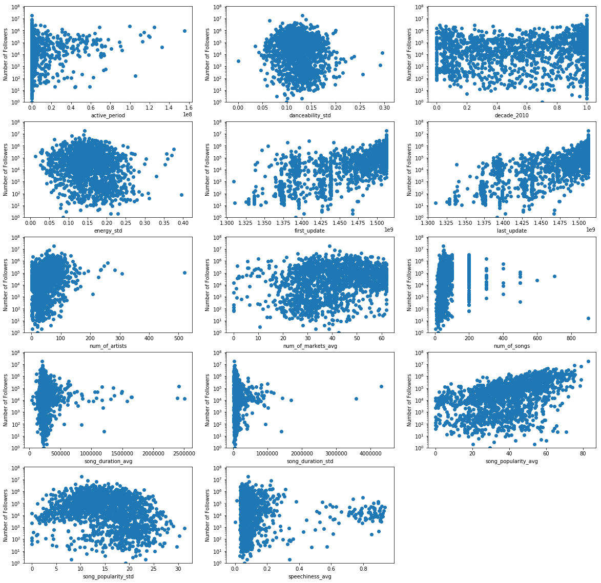

## Contents
{:.no_toc}
*  
{: toc}


# Baseline Model 


```python
import numpy as np
import pandas as pd
import matplotlib.pyplot as plt
from sklearn.preprocessing import MinMaxScaler
import statsmodels.api as sm
from sklearn.model_selection import train_test_split
from sklearn.linear_model import RidgeCV
from sklearn.linear_model import LassoCV

%matplotlib inline
```


    /home/pui-user/.local/lib/python2.7/site-packages/statsmodels/compat/pandas.py:56: FutureWarning: The pandas.core.datetools module is deprecated and will be removed in a future version. Please use the pandas.tseries module instead.
      from pandas.core import datetools


### 1. Reading the Data


```python
data = pd.read_csv('data_spotify_v3.csv', index_col= 0)
print(data.shape)
print(data.columns.values)
print("\nPercentage of the playlists for the different decades")
np.mean(data.iloc[:,8:20], axis=0)

data.iloc[:,8:20].head(200)
```


    (1636, 55)
    ['acousticness_avg' 'acousticness_std' 'active_period' 'artist_genres'
     'artist_popularity_avg' 'artist_popularity_std' 'danceability_avg'
     'danceability_std' 'decade_1900' 'decade_1910' 'decade_1920' 'decade_1930'
     'decade_1940' 'decade_1950' 'decade_1960' 'decade_1970' 'decade_1980'
     'decade_1990' 'decade_2000' 'decade_2010' 'duration_ms_avg'
     'duration_ms_std' 'energy_avg' 'energy_std' 'first_update' 'followers'
     'instrumentalness_avg' 'instrumentalness_std' 'is_collaborative'
     'is_public' 'key_avg' 'key_std' 'last_update' 'liveness_avg'
     'liveness_std' 'loudness_avg' 'loudness_std' 'mode_avg' 'mode_std'
     'num_of_artists' 'num_of_markets_avg' 'num_of_songs'
     'playlist_name_length' 'song_duration_avg' 'song_duration_std'
     'song_popularity_avg' 'song_popularity_std' 'speechiness_avg'
     'speechiness_std' 'tempo_avg' 'tempo_std' 'time_signature_avg'
     'time_signature_std' 'valence_avg' 'valence_std']
    
    Percentage of the playlists for the different decades


<div>
<style>
    .dataframe thead tr:only-child th {
        text-align: right;
    }

    .dataframe thead th {
        text-align: left;
    }

    .dataframe tbody tr th {
        vertical-align: top;
    }
</style>
<table border="1" class="dataframe">
  <thead>
    <tr style="text-align: right;">
      <th></th>
      <th>decade_1900</th>
      <th>decade_1910</th>
      <th>decade_1920</th>
      <th>decade_1930</th>
      <th>decade_1940</th>
      <th>decade_1950</th>
      <th>decade_1960</th>
      <th>decade_1970</th>
      <th>decade_1980</th>
      <th>decade_1990</th>
      <th>decade_2000</th>
      <th>decade_2010</th>
    </tr>
  </thead>
  <tbody>
    <tr>
      <th>0</th>
      <td>0.0</td>
      <td>0</td>
      <td>0.0</td>
      <td>0.0</td>
      <td>0.0</td>
      <td>0.0</td>
      <td>0.00000</td>
      <td>0.000000</td>
      <td>0.000000</td>
      <td>0.000000</td>
      <td>0.000000</td>
      <td>1.000000</td>
    </tr>
    <tr>
      <th>1</th>
      <td>0.0</td>
      <td>0</td>
      <td>0.0</td>
      <td>0.0</td>
      <td>0.0</td>
      <td>0.0</td>
      <td>0.00000</td>
      <td>0.000000</td>
      <td>0.000000</td>
      <td>0.000000</td>
      <td>0.000000</td>
      <td>1.000000</td>
    </tr>
    <tr>
      <th>2</th>
      <td>0.0</td>
      <td>0</td>
      <td>0.0</td>
      <td>0.0</td>
      <td>0.0</td>
      <td>0.0</td>
      <td>0.00000</td>
      <td>0.000000</td>
      <td>0.000000</td>
      <td>0.000000</td>
      <td>0.000000</td>
      <td>1.000000</td>
    </tr>
    <tr>
      <th>3</th>
      <td>0.0</td>
      <td>0</td>
      <td>0.0</td>
      <td>0.0</td>
      <td>0.0</td>
      <td>0.0</td>
      <td>0.00000</td>
      <td>0.000000</td>
      <td>0.000000</td>
      <td>0.000000</td>
      <td>0.000000</td>
      <td>1.000000</td>
    </tr>
    <tr>
      <th>4</th>
      <td>0.0</td>
      <td>0</td>
      <td>0.0</td>
      <td>0.0</td>
      <td>0.0</td>
      <td>0.0</td>
      <td>0.00000</td>
      <td>0.000000</td>
      <td>0.000000</td>
      <td>0.000000</td>
      <td>0.000000</td>
      <td>1.000000</td>
    </tr>
    <tr>
      <th>5</th>
      <td>0.0</td>
      <td>0</td>
      <td>0.0</td>
      <td>0.0</td>
      <td>0.0</td>
      <td>0.0</td>
      <td>0.00000</td>
      <td>0.000000</td>
      <td>0.000000</td>
      <td>0.000000</td>
      <td>0.000000</td>
      <td>1.000000</td>
    </tr>
    <tr>
      <th>6</th>
      <td>0.0</td>
      <td>0</td>
      <td>0.0</td>
      <td>0.0</td>
      <td>0.0</td>
      <td>0.0</td>
      <td>0.00000</td>
      <td>0.000000</td>
      <td>0.000000</td>
      <td>0.000000</td>
      <td>0.000000</td>
      <td>1.000000</td>
    </tr>
    <tr>
      <th>7</th>
      <td>0.0</td>
      <td>0</td>
      <td>0.0</td>
      <td>0.0</td>
      <td>0.0</td>
      <td>0.0</td>
      <td>0.00000</td>
      <td>0.000000</td>
      <td>0.000000</td>
      <td>0.000000</td>
      <td>0.000000</td>
      <td>1.000000</td>
    </tr>
    <tr>
      <th>8</th>
      <td>0.0</td>
      <td>0</td>
      <td>0.0</td>
      <td>0.0</td>
      <td>0.0</td>
      <td>0.0</td>
      <td>0.00000</td>
      <td>0.000000</td>
      <td>0.000000</td>
      <td>0.000000</td>
      <td>0.074074</td>
      <td>0.925926</td>
    </tr>
    <tr>
      <th>9</th>
      <td>0.0</td>
      <td>0</td>
      <td>0.0</td>
      <td>0.0</td>
      <td>0.0</td>
      <td>0.0</td>
      <td>0.00000</td>
      <td>0.000000</td>
      <td>0.000000</td>
      <td>0.000000</td>
      <td>0.040000</td>
      <td>0.960000</td>
    </tr>
    <tr>
      <th>10</th>
      <td>0.0</td>
      <td>0</td>
      <td>0.0</td>
      <td>0.0</td>
      <td>0.0</td>
      <td>0.0</td>
      <td>0.00000</td>
      <td>0.000000</td>
      <td>0.000000</td>
      <td>0.000000</td>
      <td>0.000000</td>
      <td>1.000000</td>
    </tr>
    <tr>
      <th>11</th>
      <td>0.0</td>
      <td>0</td>
      <td>0.0</td>
      <td>0.0</td>
      <td>0.0</td>
      <td>0.0</td>
      <td>0.00000</td>
      <td>0.000000</td>
      <td>0.000000</td>
      <td>0.012195</td>
      <td>0.097561</td>
      <td>0.890244</td>
    </tr>
    <tr>
      <th>12</th>
      <td>0.0</td>
      <td>0</td>
      <td>0.0</td>
      <td>0.0</td>
      <td>0.0</td>
      <td>0.0</td>
      <td>0.00000</td>
      <td>0.000000</td>
      <td>0.000000</td>
      <td>0.000000</td>
      <td>0.000000</td>
      <td>1.000000</td>
    </tr>
    <tr>
      <th>13</th>
      <td>0.0</td>
      <td>0</td>
      <td>0.0</td>
      <td>0.0</td>
      <td>0.0</td>
      <td>0.0</td>
      <td>0.00000</td>
      <td>0.000000</td>
      <td>0.000000</td>
      <td>0.000000</td>
      <td>0.000000</td>
      <td>1.000000</td>
    </tr>
    <tr>
      <th>14</th>
      <td>0.0</td>
      <td>0</td>
      <td>0.0</td>
      <td>0.0</td>
      <td>0.0</td>
      <td>0.0</td>
      <td>0.00000</td>
      <td>0.000000</td>
      <td>0.000000</td>
      <td>0.000000</td>
      <td>0.000000</td>
      <td>1.000000</td>
    </tr>
    <tr>
      <th>15</th>
      <td>0.0</td>
      <td>0</td>
      <td>0.0</td>
      <td>0.0</td>
      <td>0.0</td>
      <td>0.0</td>
      <td>0.00000</td>
      <td>0.000000</td>
      <td>0.047619</td>
      <td>0.666667</td>
      <td>0.238095</td>
      <td>0.047619</td>
    </tr>
    <tr>
      <th>16</th>
      <td>0.0</td>
      <td>0</td>
      <td>0.0</td>
      <td>0.0</td>
      <td>0.0</td>
      <td>0.0</td>
      <td>0.00000</td>
      <td>0.000000</td>
      <td>0.000000</td>
      <td>0.000000</td>
      <td>0.000000</td>
      <td>1.000000</td>
    </tr>
    <tr>
      <th>17</th>
      <td>0.0</td>
      <td>0</td>
      <td>0.0</td>
      <td>0.0</td>
      <td>0.0</td>
      <td>0.0</td>
      <td>0.00000</td>
      <td>0.000000</td>
      <td>0.000000</td>
      <td>0.000000</td>
      <td>0.000000</td>
      <td>1.000000</td>
    </tr>
    <tr>
      <th>18</th>
      <td>0.0</td>
      <td>0</td>
      <td>0.0</td>
      <td>0.0</td>
      <td>0.0</td>
      <td>0.0</td>
      <td>0.00000</td>
      <td>0.000000</td>
      <td>0.000000</td>
      <td>0.000000</td>
      <td>0.000000</td>
      <td>1.000000</td>
    </tr>
    <tr>
      <th>19</th>
      <td>0.0</td>
      <td>0</td>
      <td>0.0</td>
      <td>0.0</td>
      <td>0.0</td>
      <td>0.0</td>
      <td>0.00000</td>
      <td>0.000000</td>
      <td>0.000000</td>
      <td>0.000000</td>
      <td>0.100000</td>
      <td>0.900000</td>
    </tr>
    <tr>
      <th>20</th>
      <td>0.0</td>
      <td>0</td>
      <td>0.0</td>
      <td>0.0</td>
      <td>0.0</td>
      <td>0.0</td>
      <td>0.00000</td>
      <td>0.090909</td>
      <td>0.045455</td>
      <td>0.136364</td>
      <td>0.272727</td>
      <td>0.454545</td>
    </tr>
    <tr>
      <th>21</th>
      <td>0.0</td>
      <td>0</td>
      <td>0.0</td>
      <td>0.0</td>
      <td>0.0</td>
      <td>0.0</td>
      <td>0.00000</td>
      <td>0.000000</td>
      <td>0.000000</td>
      <td>0.000000</td>
      <td>0.122449</td>
      <td>0.877551</td>
    </tr>
    <tr>
      <th>22</th>
      <td>0.0</td>
      <td>0</td>
      <td>0.0</td>
      <td>0.0</td>
      <td>0.0</td>
      <td>0.0</td>
      <td>0.00000</td>
      <td>0.000000</td>
      <td>0.000000</td>
      <td>0.224138</td>
      <td>0.155172</td>
      <td>0.620690</td>
    </tr>
    <tr>
      <th>23</th>
      <td>0.0</td>
      <td>0</td>
      <td>0.0</td>
      <td>0.0</td>
      <td>0.0</td>
      <td>0.0</td>
      <td>0.50000</td>
      <td>0.420000</td>
      <td>0.000000</td>
      <td>0.000000</td>
      <td>0.020000</td>
      <td>0.060000</td>
    </tr>
    <tr>
      <th>24</th>
      <td>0.0</td>
      <td>0</td>
      <td>0.0</td>
      <td>0.0</td>
      <td>0.0</td>
      <td>0.0</td>
      <td>0.00000</td>
      <td>0.428571</td>
      <td>0.228571</td>
      <td>0.085714</td>
      <td>0.114286</td>
      <td>0.142857</td>
    </tr>
    <tr>
      <th>25</th>
      <td>0.0</td>
      <td>0</td>
      <td>0.0</td>
      <td>0.0</td>
      <td>0.0</td>
      <td>0.0</td>
      <td>0.00000</td>
      <td>0.000000</td>
      <td>0.000000</td>
      <td>0.000000</td>
      <td>0.360000</td>
      <td>0.640000</td>
    </tr>
    <tr>
      <th>26</th>
      <td>0.0</td>
      <td>0</td>
      <td>0.0</td>
      <td>0.0</td>
      <td>0.0</td>
      <td>0.0</td>
      <td>0.00000</td>
      <td>0.538462</td>
      <td>0.000000</td>
      <td>0.000000</td>
      <td>0.384615</td>
      <td>0.076923</td>
    </tr>
    <tr>
      <th>27</th>
      <td>0.0</td>
      <td>0</td>
      <td>0.0</td>
      <td>0.0</td>
      <td>0.0</td>
      <td>0.0</td>
      <td>0.00000</td>
      <td>0.000000</td>
      <td>0.000000</td>
      <td>0.000000</td>
      <td>0.000000</td>
      <td>1.000000</td>
    </tr>
    <tr>
      <th>28</th>
      <td>0.0</td>
      <td>0</td>
      <td>0.0</td>
      <td>0.0</td>
      <td>0.0</td>
      <td>0.0</td>
      <td>0.00000</td>
      <td>0.000000</td>
      <td>0.000000</td>
      <td>0.428571</td>
      <td>0.333333</td>
      <td>0.238095</td>
    </tr>
    <tr>
      <th>29</th>
      <td>0.0</td>
      <td>0</td>
      <td>0.0</td>
      <td>0.0</td>
      <td>0.0</td>
      <td>0.0</td>
      <td>0.26000</td>
      <td>0.180000</td>
      <td>0.100000</td>
      <td>0.120000</td>
      <td>0.220000</td>
      <td>0.120000</td>
    </tr>
    <tr>
      <th>...</th>
      <td>...</td>
      <td>...</td>
      <td>...</td>
      <td>...</td>
      <td>...</td>
      <td>...</td>
      <td>...</td>
      <td>...</td>
      <td>...</td>
      <td>...</td>
      <td>...</td>
      <td>...</td>
    </tr>
    <tr>
      <th>170</th>
      <td>0.0</td>
      <td>0</td>
      <td>0.0</td>
      <td>0.0</td>
      <td>0.0</td>
      <td>0.0</td>
      <td>0.00000</td>
      <td>0.000000</td>
      <td>0.000000</td>
      <td>0.000000</td>
      <td>0.000000</td>
      <td>1.000000</td>
    </tr>
    <tr>
      <th>171</th>
      <td>0.0</td>
      <td>0</td>
      <td>0.0</td>
      <td>0.0</td>
      <td>0.0</td>
      <td>0.0</td>
      <td>0.00000</td>
      <td>0.000000</td>
      <td>0.000000</td>
      <td>0.000000</td>
      <td>0.000000</td>
      <td>1.000000</td>
    </tr>
    <tr>
      <th>172</th>
      <td>0.0</td>
      <td>0</td>
      <td>0.0</td>
      <td>0.0</td>
      <td>0.0</td>
      <td>0.0</td>
      <td>0.00000</td>
      <td>0.000000</td>
      <td>0.000000</td>
      <td>0.000000</td>
      <td>0.000000</td>
      <td>1.000000</td>
    </tr>
    <tr>
      <th>173</th>
      <td>0.0</td>
      <td>0</td>
      <td>0.0</td>
      <td>0.0</td>
      <td>0.0</td>
      <td>0.0</td>
      <td>0.00000</td>
      <td>0.000000</td>
      <td>0.000000</td>
      <td>0.516129</td>
      <td>0.483871</td>
      <td>0.000000</td>
    </tr>
    <tr>
      <th>174</th>
      <td>0.0</td>
      <td>0</td>
      <td>0.0</td>
      <td>0.0</td>
      <td>0.0</td>
      <td>0.0</td>
      <td>0.00000</td>
      <td>0.000000</td>
      <td>0.000000</td>
      <td>0.000000</td>
      <td>0.000000</td>
      <td>1.000000</td>
    </tr>
    <tr>
      <th>175</th>
      <td>0.0</td>
      <td>0</td>
      <td>0.0</td>
      <td>0.0</td>
      <td>0.0</td>
      <td>0.0</td>
      <td>0.00000</td>
      <td>0.000000</td>
      <td>0.000000</td>
      <td>0.000000</td>
      <td>0.000000</td>
      <td>1.000000</td>
    </tr>
    <tr>
      <th>176</th>
      <td>0.0</td>
      <td>0</td>
      <td>0.0</td>
      <td>0.0</td>
      <td>0.0</td>
      <td>0.0</td>
      <td>0.00000</td>
      <td>0.000000</td>
      <td>0.000000</td>
      <td>0.000000</td>
      <td>0.000000</td>
      <td>1.000000</td>
    </tr>
    <tr>
      <th>177</th>
      <td>0.0</td>
      <td>0</td>
      <td>0.0</td>
      <td>0.0</td>
      <td>0.0</td>
      <td>0.0</td>
      <td>0.00000</td>
      <td>0.000000</td>
      <td>0.000000</td>
      <td>0.100000</td>
      <td>0.100000</td>
      <td>0.800000</td>
    </tr>
    <tr>
      <th>178</th>
      <td>0.0</td>
      <td>0</td>
      <td>0.0</td>
      <td>0.0</td>
      <td>0.0</td>
      <td>0.0</td>
      <td>0.00000</td>
      <td>0.000000</td>
      <td>0.000000</td>
      <td>0.066667</td>
      <td>0.050000</td>
      <td>0.883333</td>
    </tr>
    <tr>
      <th>179</th>
      <td>0.0</td>
      <td>0</td>
      <td>0.0</td>
      <td>0.0</td>
      <td>0.0</td>
      <td>0.0</td>
      <td>0.00000</td>
      <td>0.000000</td>
      <td>0.040000</td>
      <td>0.020000</td>
      <td>0.120000</td>
      <td>0.820000</td>
    </tr>
    <tr>
      <th>180</th>
      <td>0.0</td>
      <td>0</td>
      <td>0.0</td>
      <td>0.0</td>
      <td>0.0</td>
      <td>0.0</td>
      <td>0.00000</td>
      <td>0.000000</td>
      <td>0.000000</td>
      <td>0.000000</td>
      <td>0.133333</td>
      <td>0.866667</td>
    </tr>
    <tr>
      <th>181</th>
      <td>0.0</td>
      <td>0</td>
      <td>0.0</td>
      <td>0.0</td>
      <td>0.0</td>
      <td>0.0</td>
      <td>0.00000</td>
      <td>0.000000</td>
      <td>0.000000</td>
      <td>0.000000</td>
      <td>0.280000</td>
      <td>0.720000</td>
    </tr>
    <tr>
      <th>182</th>
      <td>0.0</td>
      <td>0</td>
      <td>0.0</td>
      <td>0.0</td>
      <td>0.0</td>
      <td>0.0</td>
      <td>0.00000</td>
      <td>0.000000</td>
      <td>0.000000</td>
      <td>0.000000</td>
      <td>0.476190</td>
      <td>0.523810</td>
    </tr>
    <tr>
      <th>183</th>
      <td>0.0</td>
      <td>0</td>
      <td>0.0</td>
      <td>0.0</td>
      <td>0.0</td>
      <td>0.0</td>
      <td>0.00000</td>
      <td>0.000000</td>
      <td>0.000000</td>
      <td>0.000000</td>
      <td>0.066667</td>
      <td>0.933333</td>
    </tr>
    <tr>
      <th>184</th>
      <td>0.0</td>
      <td>0</td>
      <td>0.0</td>
      <td>0.0</td>
      <td>0.0</td>
      <td>0.0</td>
      <td>0.00000</td>
      <td>0.000000</td>
      <td>0.000000</td>
      <td>0.057143</td>
      <td>0.028571</td>
      <td>0.914286</td>
    </tr>
    <tr>
      <th>185</th>
      <td>0.0</td>
      <td>0</td>
      <td>0.0</td>
      <td>0.0</td>
      <td>0.0</td>
      <td>0.0</td>
      <td>0.00000</td>
      <td>0.000000</td>
      <td>0.000000</td>
      <td>0.000000</td>
      <td>0.000000</td>
      <td>1.000000</td>
    </tr>
    <tr>
      <th>186</th>
      <td>0.0</td>
      <td>0</td>
      <td>0.0</td>
      <td>0.0</td>
      <td>0.0</td>
      <td>0.0</td>
      <td>0.47619</td>
      <td>0.047619</td>
      <td>0.000000</td>
      <td>0.000000</td>
      <td>0.428571</td>
      <td>0.047619</td>
    </tr>
    <tr>
      <th>187</th>
      <td>0.0</td>
      <td>0</td>
      <td>0.0</td>
      <td>0.0</td>
      <td>0.0</td>
      <td>0.0</td>
      <td>0.00000</td>
      <td>0.000000</td>
      <td>0.000000</td>
      <td>0.000000</td>
      <td>0.000000</td>
      <td>1.000000</td>
    </tr>
    <tr>
      <th>188</th>
      <td>0.0</td>
      <td>0</td>
      <td>0.0</td>
      <td>0.0</td>
      <td>0.0</td>
      <td>0.0</td>
      <td>0.00000</td>
      <td>0.000000</td>
      <td>0.000000</td>
      <td>0.000000</td>
      <td>0.000000</td>
      <td>1.000000</td>
    </tr>
    <tr>
      <th>189</th>
      <td>0.0</td>
      <td>0</td>
      <td>0.0</td>
      <td>0.0</td>
      <td>0.0</td>
      <td>0.0</td>
      <td>0.00000</td>
      <td>0.000000</td>
      <td>0.000000</td>
      <td>0.000000</td>
      <td>0.000000</td>
      <td>1.000000</td>
    </tr>
    <tr>
      <th>190</th>
      <td>0.0</td>
      <td>0</td>
      <td>0.0</td>
      <td>0.0</td>
      <td>0.0</td>
      <td>0.0</td>
      <td>0.00000</td>
      <td>0.000000</td>
      <td>0.000000</td>
      <td>0.022222</td>
      <td>0.111111</td>
      <td>0.866667</td>
    </tr>
    <tr>
      <th>191</th>
      <td>0.0</td>
      <td>0</td>
      <td>0.0</td>
      <td>0.0</td>
      <td>0.0</td>
      <td>0.0</td>
      <td>0.00000</td>
      <td>0.000000</td>
      <td>0.000000</td>
      <td>0.000000</td>
      <td>0.000000</td>
      <td>1.000000</td>
    </tr>
    <tr>
      <th>192</th>
      <td>0.0</td>
      <td>0</td>
      <td>0.0</td>
      <td>0.0</td>
      <td>0.0</td>
      <td>0.0</td>
      <td>0.00000</td>
      <td>0.000000</td>
      <td>0.000000</td>
      <td>0.000000</td>
      <td>0.000000</td>
      <td>1.000000</td>
    </tr>
    <tr>
      <th>193</th>
      <td>0.0</td>
      <td>0</td>
      <td>0.0</td>
      <td>0.0</td>
      <td>0.0</td>
      <td>0.0</td>
      <td>0.00000</td>
      <td>0.020000</td>
      <td>0.200000</td>
      <td>0.200000</td>
      <td>0.160000</td>
      <td>0.420000</td>
    </tr>
    <tr>
      <th>194</th>
      <td>0.0</td>
      <td>0</td>
      <td>0.0</td>
      <td>0.0</td>
      <td>0.0</td>
      <td>0.0</td>
      <td>0.00000</td>
      <td>0.000000</td>
      <td>0.020408</td>
      <td>0.367347</td>
      <td>0.387755</td>
      <td>0.224490</td>
    </tr>
    <tr>
      <th>195</th>
      <td>0.0</td>
      <td>0</td>
      <td>0.0</td>
      <td>0.0</td>
      <td>0.0</td>
      <td>0.0</td>
      <td>0.00000</td>
      <td>0.000000</td>
      <td>0.000000</td>
      <td>0.100000</td>
      <td>0.040000</td>
      <td>0.860000</td>
    </tr>
    <tr>
      <th>196</th>
      <td>0.0</td>
      <td>0</td>
      <td>0.0</td>
      <td>0.0</td>
      <td>0.0</td>
      <td>0.0</td>
      <td>0.00000</td>
      <td>0.000000</td>
      <td>0.020833</td>
      <td>0.854167</td>
      <td>0.104167</td>
      <td>0.020833</td>
    </tr>
    <tr>
      <th>197</th>
      <td>0.0</td>
      <td>0</td>
      <td>0.0</td>
      <td>0.0</td>
      <td>0.0</td>
      <td>0.0</td>
      <td>0.00000</td>
      <td>0.044444</td>
      <td>0.022222</td>
      <td>0.177778</td>
      <td>0.444444</td>
      <td>0.311111</td>
    </tr>
    <tr>
      <th>198</th>
      <td>0.0</td>
      <td>0</td>
      <td>0.0</td>
      <td>0.0</td>
      <td>0.0</td>
      <td>0.0</td>
      <td>0.00000</td>
      <td>0.000000</td>
      <td>0.000000</td>
      <td>0.020000</td>
      <td>0.020000</td>
      <td>0.960000</td>
    </tr>
    <tr>
      <th>199</th>
      <td>0.0</td>
      <td>0</td>
      <td>0.0</td>
      <td>0.0</td>
      <td>0.0</td>
      <td>0.0</td>
      <td>0.02000</td>
      <td>0.260000</td>
      <td>0.060000</td>
      <td>0.220000</td>
      <td>0.380000</td>
      <td>0.060000</td>
    </tr>
  </tbody>
</table>
<p>200 rows × 12 columns</p>
</div>


### 2. Data Transformation and creating of Train and Test sets


```python
# Dropping null values
data.dropna(how='any', inplace= True)
data.shape

# Dropping features that present zero variance
data.drop(['is_collaborative', 'is_public','decade_1910'], axis =1 , inplace= True)

# Getting features
data1 = data.copy()
X = data1.drop(['followers'], axis = 1)

# Scaling X
scaler = MinMaxScaler().fit(X)
data1 = scaler.transform(X)
data1 = pd.DataFrame(data1, columns= X.columns)
data1['followers'] = data['followers']


# Creating a dataset with ln(Y)
data3 = data1.copy()
data3['followers'] = np.log(1 + data3['followers'])


y = (data1['followers'])
X = data1.drop(['followers'], axis = 1)

y2 = (data3['followers'])
X2 = data3.drop(['followers'], axis = 1)
X2.shape, y2.shape

# Creating Train and Test sets
X_train, X_test, y_train, y_test = train_test_split(X2, y2, test_size=0.33, random_state=42)
```


### 3. Fitting a basic Linear Model to the entire data


```python
X = sm.add_constant(X)
model = sm.OLS(y,X)
results = model.fit()
results.summary()
```


<table class="simpletable">
<caption>OLS Regression Results</caption>
<tr>
  <th>Dep. Variable:</th>        <td>followers</td>    <th>  R-squared:         </th> <td>   0.196</td> 
</tr>
<tr>
  <th>Model:</th>                   <td>OLS</td>       <th>  Adj. R-squared:    </th> <td>   0.171</td> 
</tr>
<tr>
  <th>Method:</th>             <td>Least Squares</td>  <th>  F-statistic:       </th> <td>   7.881</td> 
</tr>
<tr>
  <th>Date:</th>             <td>Thu, 07 Dec 2017</td> <th>  Prob (F-statistic):</th> <td>3.55e-47</td> 
</tr>
<tr>
  <th>Time:</th>                 <td>18:38:49</td>     <th>  Log-Likelihood:    </th> <td> -24118.</td> 
</tr>
<tr>
  <th>No. Observations:</th>      <td>  1636</td>      <th>  AIC:               </th> <td>4.834e+04</td>
</tr>
<tr>
  <th>Df Residuals:</th>          <td>  1586</td>      <th>  BIC:               </th> <td>4.861e+04</td>
</tr>
<tr>
  <th>Df Model:</th>              <td>    49</td>      <th>                     </th>     <td> </td>    
</tr>
<tr>
  <th>Covariance Type:</th>      <td>nonrobust</td>    <th>                     </th>     <td> </td>    
</tr>
</table>
<table class="simpletable">
<tr>
            <td></td>               <th>coef</th>     <th>std err</th>      <th>t</th>      <th>P>|t|</th>  <th>[0.025</th>    <th>0.975]</th>  
</tr>
<tr>
  <th>const</th>                 <td>-5.875e+05</td> <td> 4.49e+05</td> <td>   -1.309</td> <td> 0.191</td> <td>-1.47e+06</td> <td> 2.93e+05</td>
</tr>
<tr>
  <th>acousticness_avg</th>      <td> 1.503e+05</td> <td> 1.98e+05</td> <td>    0.759</td> <td> 0.448</td> <td>-2.38e+05</td> <td> 5.39e+05</td>
</tr>
<tr>
  <th>acousticness_std</th>      <td>-3439.6405</td> <td>  1.5e+05</td> <td>   -0.023</td> <td> 0.982</td> <td>-2.97e+05</td> <td>  2.9e+05</td>
</tr>
<tr>
  <th>active_period</th>         <td> 1.339e+05</td> <td>  1.2e+05</td> <td>    1.120</td> <td> 0.263</td> <td>-1.01e+05</td> <td> 3.68e+05</td>
</tr>
<tr>
  <th>artist_genres</th>         <td> 1.761e+04</td> <td> 1.73e+05</td> <td>    0.102</td> <td> 0.919</td> <td>-3.22e+05</td> <td> 3.57e+05</td>
</tr>
<tr>
  <th>artist_popularity_avg</th> <td>-1.713e+05</td> <td> 2.19e+05</td> <td>   -0.780</td> <td> 0.435</td> <td>-6.02e+05</td> <td> 2.59e+05</td>
</tr>
<tr>
  <th>artist_popularity_std</th> <td> 1.502e+05</td> <td> 1.62e+05</td> <td>    0.927</td> <td> 0.354</td> <td>-1.68e+05</td> <td> 4.68e+05</td>
</tr>
<tr>
  <th>danceability_avg</th>      <td> 3.615e+05</td> <td> 2.65e+05</td> <td>    1.366</td> <td> 0.172</td> <td>-1.58e+05</td> <td>  8.8e+05</td>
</tr>
<tr>
  <th>danceability_std</th>      <td>  1.44e+04</td> <td> 2.33e+05</td> <td>    0.062</td> <td> 0.951</td> <td>-4.44e+05</td> <td> 4.72e+05</td>
</tr>
<tr>
  <th>decade_1900</th>           <td>-5.817e+04</td> <td> 4.44e+05</td> <td>   -0.131</td> <td> 0.896</td> <td>-9.29e+05</td> <td> 8.13e+05</td>
</tr>
<tr>
  <th>decade_1920</th>           <td>  2.02e+04</td> <td> 3.93e+05</td> <td>    0.051</td> <td> 0.959</td> <td>-7.51e+05</td> <td> 7.92e+05</td>
</tr>
<tr>
  <th>decade_1930</th>           <td>-2.031e+04</td> <td>  3.5e+05</td> <td>   -0.058</td> <td> 0.954</td> <td>-7.08e+05</td> <td> 6.67e+05</td>
</tr>
<tr>
  <th>decade_1940</th>           <td>-1.654e+05</td> <td> 3.51e+05</td> <td>   -0.471</td> <td> 0.637</td> <td>-8.54e+05</td> <td> 5.23e+05</td>
</tr>
<tr>
  <th>decade_1950</th>           <td> 6.119e+04</td> <td> 3.16e+05</td> <td>    0.194</td> <td> 0.846</td> <td>-5.59e+05</td> <td> 6.81e+05</td>
</tr>
<tr>
  <th>decade_1960</th>           <td>-1.097e+05</td> <td>  2.1e+05</td> <td>   -0.521</td> <td> 0.602</td> <td>-5.22e+05</td> <td> 3.03e+05</td>
</tr>
<tr>
  <th>decade_1970</th>           <td> 6.599e+04</td> <td> 1.71e+05</td> <td>    0.386</td> <td> 0.700</td> <td>-2.69e+05</td> <td> 4.01e+05</td>
</tr>
<tr>
  <th>decade_1980</th>           <td>-4.134e+04</td> <td> 1.68e+05</td> <td>   -0.245</td> <td> 0.806</td> <td>-3.72e+05</td> <td> 2.89e+05</td>
</tr>
<tr>
  <th>decade_1990</th>           <td> -2.44e+05</td> <td> 1.53e+05</td> <td>   -1.591</td> <td> 0.112</td> <td>-5.45e+05</td> <td> 5.67e+04</td>
</tr>
<tr>
  <th>decade_2000</th>           <td>-1.685e+05</td> <td> 1.13e+05</td> <td>   -1.485</td> <td> 0.138</td> <td>-3.91e+05</td> <td>  5.4e+04</td>
</tr>
<tr>
  <th>decade_2010</th>           <td>-1.432e+05</td> <td> 9.65e+04</td> <td>   -1.484</td> <td> 0.138</td> <td>-3.32e+05</td> <td>  4.6e+04</td>
</tr>
<tr>
  <th>duration_ms_avg</th>       <td>-2.749e+06</td> <td> 6.63e+06</td> <td>   -0.415</td> <td> 0.679</td> <td>-1.58e+07</td> <td> 1.03e+07</td>
</tr>
<tr>
  <th>duration_ms_std</th>       <td> 8.903e+05</td> <td> 1.42e+06</td> <td>    0.627</td> <td> 0.531</td> <td>-1.89e+06</td> <td> 3.67e+06</td>
</tr>
<tr>
  <th>energy_avg</th>            <td> 1.011e+05</td> <td> 3.65e+05</td> <td>    0.277</td> <td> 0.782</td> <td>-6.14e+05</td> <td> 8.16e+05</td>
</tr>
<tr>
  <th>energy_std</th>            <td>-3.114e+04</td> <td> 2.37e+05</td> <td>   -0.131</td> <td> 0.896</td> <td>-4.97e+05</td> <td> 4.34e+05</td>
</tr>
<tr>
  <th>first_update</th>          <td>-1018.6831</td> <td> 5.88e+04</td> <td>   -0.017</td> <td> 0.986</td> <td>-1.16e+05</td> <td> 1.14e+05</td>
</tr>
<tr>
  <th>instrumentalness_avg</th>  <td> 7.166e+04</td> <td> 1.22e+05</td> <td>    0.589</td> <td> 0.556</td> <td>-1.67e+05</td> <td>  3.1e+05</td>
</tr>
<tr>
  <th>instrumentalness_std</th>  <td>-3.766e+04</td> <td> 9.69e+04</td> <td>   -0.388</td> <td> 0.698</td> <td>-2.28e+05</td> <td> 1.52e+05</td>
</tr>
<tr>
  <th>key_avg</th>               <td>-3.699e+04</td> <td> 1.71e+05</td> <td>   -0.216</td> <td> 0.829</td> <td>-3.73e+05</td> <td> 2.99e+05</td>
</tr>
<tr>
  <th>key_std</th>               <td> 1.044e+05</td> <td> 1.87e+05</td> <td>    0.558</td> <td> 0.577</td> <td>-2.63e+05</td> <td> 4.71e+05</td>
</tr>
<tr>
  <th>last_update</th>           <td> 1.058e+05</td> <td> 6.72e+04</td> <td>    1.575</td> <td> 0.115</td> <td> -2.6e+04</td> <td> 2.37e+05</td>
</tr>
<tr>
  <th>liveness_avg</th>          <td>-2.986e+05</td> <td> 2.94e+05</td> <td>   -1.016</td> <td> 0.310</td> <td>-8.75e+05</td> <td> 2.78e+05</td>
</tr>
<tr>
  <th>liveness_std</th>          <td>  6.83e+04</td> <td> 1.56e+05</td> <td>    0.437</td> <td> 0.663</td> <td>-2.39e+05</td> <td> 3.75e+05</td>
</tr>
<tr>
  <th>loudness_avg</th>          <td> 3.265e+05</td> <td> 5.94e+05</td> <td>    0.549</td> <td> 0.583</td> <td>-8.39e+05</td> <td> 1.49e+06</td>
</tr>
<tr>
  <th>loudness_std</th>          <td>  7.47e+04</td> <td> 2.94e+05</td> <td>    0.254</td> <td> 0.800</td> <td>-5.03e+05</td> <td> 6.52e+05</td>
</tr>
<tr>
  <th>mode_avg</th>              <td> 1.699e+05</td> <td> 1.64e+05</td> <td>    1.038</td> <td> 0.299</td> <td>-1.51e+05</td> <td> 4.91e+05</td>
</tr>
<tr>
  <th>mode_std</th>              <td> 1.156e+05</td> <td> 1.85e+05</td> <td>    0.623</td> <td> 0.533</td> <td>-2.48e+05</td> <td> 4.79e+05</td>
</tr>
<tr>
  <th>num_of_artists</th>        <td> 8.229e+05</td> <td> 3.32e+05</td> <td>    2.481</td> <td> 0.013</td> <td> 1.72e+05</td> <td> 1.47e+06</td>
</tr>
<tr>
  <th>num_of_markets_avg</th>    <td>-4.574e+05</td> <td> 1.02e+05</td> <td>   -4.463</td> <td> 0.000</td> <td>-6.58e+05</td> <td>-2.56e+05</td>
</tr>
<tr>
  <th>num_of_songs</th>          <td> 2.999e+05</td> <td> 2.46e+05</td> <td>    1.217</td> <td> 0.224</td> <td>-1.84e+05</td> <td> 7.83e+05</td>
</tr>
<tr>
  <th>playlist_name_length</th>  <td>-3.134e+05</td> <td> 1.74e+05</td> <td>   -1.803</td> <td> 0.072</td> <td>-6.54e+05</td> <td> 2.76e+04</td>
</tr>
<tr>
  <th>song_duration_avg</th>     <td> 2.459e+06</td> <td> 6.88e+06</td> <td>    0.357</td> <td> 0.721</td> <td> -1.1e+07</td> <td>  1.6e+07</td>
</tr>
<tr>
  <th>song_duration_std</th>     <td>-1.456e+06</td> <td>  4.2e+06</td> <td>   -0.347</td> <td> 0.729</td> <td>-9.69e+06</td> <td> 6.78e+06</td>
</tr>
<tr>
  <th>song_popularity_avg</th>   <td> 1.563e+06</td> <td> 1.83e+05</td> <td>    8.531</td> <td> 0.000</td> <td>  1.2e+06</td> <td> 1.92e+06</td>
</tr>
<tr>
  <th>song_popularity_std</th>   <td>-7.045e+05</td> <td> 1.33e+05</td> <td>   -5.299</td> <td> 0.000</td> <td>-9.65e+05</td> <td>-4.44e+05</td>
</tr>
<tr>
  <th>speechiness_avg</th>       <td> 2.179e+05</td> <td> 2.34e+05</td> <td>    0.932</td> <td> 0.351</td> <td>-2.41e+05</td> <td> 6.76e+05</td>
</tr>
<tr>
  <th>speechiness_std</th>       <td> 9982.6599</td> <td> 1.71e+05</td> <td>    0.058</td> <td> 0.953</td> <td>-3.26e+05</td> <td> 3.46e+05</td>
</tr>
<tr>
  <th>tempo_avg</th>             <td> 2.224e+05</td> <td> 4.04e+05</td> <td>    0.551</td> <td> 0.582</td> <td>-5.69e+05</td> <td> 1.01e+06</td>
</tr>
<tr>
  <th>tempo_std</th>             <td> 1.835e+04</td> <td> 2.02e+05</td> <td>    0.091</td> <td> 0.928</td> <td>-3.78e+05</td> <td> 4.15e+05</td>
</tr>
<tr>
  <th>time_signature_avg</th>    <td>-1.077e+05</td> <td> 5.55e+05</td> <td>   -0.194</td> <td> 0.846</td> <td> -1.2e+06</td> <td> 9.81e+05</td>
</tr>
<tr>
  <th>time_signature_std</th>    <td> 1.712e+05</td> <td> 1.84e+05</td> <td>    0.930</td> <td> 0.353</td> <td> -1.9e+05</td> <td> 5.32e+05</td>
</tr>
<tr>
  <th>valence_avg</th>           <td>-2.005e+05</td> <td> 1.97e+05</td> <td>   -1.020</td> <td> 0.308</td> <td>-5.86e+05</td> <td> 1.85e+05</td>
</tr>
<tr>
  <th>valence_std</th>           <td> -1.28e+05</td> <td> 1.72e+05</td> <td>   -0.745</td> <td> 0.457</td> <td>-4.65e+05</td> <td> 2.09e+05</td>
</tr>
</table>
<table class="simpletable">
<tr>
  <th>Omnibus:</th>       <td>3276.753</td> <th>  Durbin-Watson:     </th>   <td>   0.660</td>  
</tr>
<tr>
  <th>Prob(Omnibus):</th>  <td> 0.000</td>  <th>  Jarque-Bera (JB):  </th> <td>10243808.975</td>
</tr>
<tr>
  <th>Skew:</th>           <td>15.518</td>  <th>  Prob(JB):          </th>   <td>    0.00</td>  
</tr>
<tr>
  <th>Kurtosis:</th>       <td>389.410</td> <th>  Cond. No.          </th>   <td>2.10e+16</td>  
</tr>
</table>


*** The R-square value is very low. So next we try with the log of the number of followers ***

### 4.Fitting a linear model with log of Y variable


```python
X2 = sm.add_constant(X2)
model = sm.OLS(y2,X2)
results = model.fit()
results.summary()
```


<table class="simpletable">
<caption>OLS Regression Results</caption>
<tr>
  <th>Dep. Variable:</th>        <td>followers</td>    <th>  R-squared:         </th> <td>   0.594</td> 
</tr>
<tr>
  <th>Model:</th>                   <td>OLS</td>       <th>  Adj. R-squared:    </th> <td>   0.582</td> 
</tr>
<tr>
  <th>Method:</th>             <td>Least Squares</td>  <th>  F-statistic:       </th> <td>   47.40</td> 
</tr>
<tr>
  <th>Date:</th>             <td>Thu, 07 Dec 2017</td> <th>  Prob (F-statistic):</th> <td>1.81e-271</td>
</tr>
<tr>
  <th>Time:</th>                 <td>18:39:06</td>     <th>  Log-Likelihood:    </th> <td> -3499.5</td> 
</tr>
<tr>
  <th>No. Observations:</th>      <td>  1636</td>      <th>  AIC:               </th> <td>   7099.</td> 
</tr>
<tr>
  <th>Df Residuals:</th>          <td>  1586</td>      <th>  BIC:               </th> <td>   7369.</td> 
</tr>
<tr>
  <th>Df Model:</th>              <td>    49</td>      <th>                     </th>     <td> </td>    
</tr>
<tr>
  <th>Covariance Type:</th>      <td>nonrobust</td>    <th>                     </th>     <td> </td>    
</tr>
</table>
<table class="simpletable">
<tr>
            <td></td>               <th>coef</th>     <th>std err</th>      <th>t</th>      <th>P>|t|</th>  <th>[0.025</th>    <th>0.975]</th>  
</tr>
<tr>
  <th>const</th>                 <td>   -0.8612</td> <td>    1.509</td> <td>   -0.571</td> <td> 0.568</td> <td>   -3.822</td> <td>    2.099</td>
</tr>
<tr>
  <th>acousticness_avg</th>      <td>   -0.7235</td> <td>    0.665</td> <td>   -1.087</td> <td> 0.277</td> <td>   -2.029</td> <td>    0.582</td>
</tr>
<tr>
  <th>acousticness_std</th>      <td>    0.7157</td> <td>    0.503</td> <td>    1.424</td> <td> 0.155</td> <td>   -0.270</td> <td>    1.702</td>
</tr>
<tr>
  <th>active_period</th>         <td>    2.8769</td> <td>    0.402</td> <td>    7.159</td> <td> 0.000</td> <td>    2.089</td> <td>    3.665</td>
</tr>
<tr>
  <th>artist_genres</th>         <td>   -0.8077</td> <td>    0.582</td> <td>   -1.388</td> <td> 0.165</td> <td>   -1.949</td> <td>    0.334</td>
</tr>
<tr>
  <th>artist_popularity_avg</th> <td>   -0.4280</td> <td>    0.738</td> <td>   -0.580</td> <td> 0.562</td> <td>   -1.875</td> <td>    1.019</td>
</tr>
<tr>
  <th>artist_popularity_std</th> <td>   -0.9770</td> <td>    0.545</td> <td>   -1.793</td> <td> 0.073</td> <td>   -2.046</td> <td>    0.092</td>
</tr>
<tr>
  <th>danceability_avg</th>      <td>    0.3718</td> <td>    0.890</td> <td>    0.418</td> <td> 0.676</td> <td>   -1.373</td> <td>    2.117</td>
</tr>
<tr>
  <th>danceability_std</th>      <td>    1.8867</td> <td>    0.785</td> <td>    2.404</td> <td> 0.016</td> <td>    0.347</td> <td>    3.426</td>
</tr>
<tr>
  <th>decade_1900</th>           <td>   -1.2136</td> <td>    1.493</td> <td>   -0.813</td> <td> 0.416</td> <td>   -4.142</td> <td>    1.714</td>
</tr>
<tr>
  <th>decade_1920</th>           <td>    0.7464</td> <td>    1.322</td> <td>    0.565</td> <td> 0.572</td> <td>   -1.847</td> <td>    3.339</td>
</tr>
<tr>
  <th>decade_1930</th>           <td>    1.7468</td> <td>    1.178</td> <td>    1.483</td> <td> 0.138</td> <td>   -0.564</td> <td>    4.058</td>
</tr>
<tr>
  <th>decade_1940</th>           <td>    0.3660</td> <td>    1.180</td> <td>    0.310</td> <td> 0.756</td> <td>   -1.948</td> <td>    2.680</td>
</tr>
<tr>
  <th>decade_1950</th>           <td>    0.1441</td> <td>    1.062</td> <td>    0.136</td> <td> 0.892</td> <td>   -1.940</td> <td>    2.228</td>
</tr>
<tr>
  <th>decade_1960</th>           <td>    0.5787</td> <td>    0.707</td> <td>    0.818</td> <td> 0.413</td> <td>   -0.809</td> <td>    1.966</td>
</tr>
<tr>
  <th>decade_1970</th>           <td>    0.0600</td> <td>    0.575</td> <td>    0.104</td> <td> 0.917</td> <td>   -1.068</td> <td>    1.188</td>
</tr>
<tr>
  <th>decade_1980</th>           <td>    0.0196</td> <td>    0.566</td> <td>    0.035</td> <td> 0.972</td> <td>   -1.091</td> <td>    1.131</td>
</tr>
<tr>
  <th>decade_1990</th>           <td>   -0.8263</td> <td>    0.515</td> <td>   -1.603</td> <td> 0.109</td> <td>   -1.837</td> <td>    0.185</td>
</tr>
<tr>
  <th>decade_2000</th>           <td>    0.0860</td> <td>    0.381</td> <td>    0.226</td> <td> 0.822</td> <td>   -0.662</td> <td>    0.834</td>
</tr>
<tr>
  <th>decade_2010</th>           <td>   -0.9613</td> <td>    0.324</td> <td>   -2.964</td> <td> 0.003</td> <td>   -1.597</td> <td>   -0.325</td>
</tr>
<tr>
  <th>duration_ms_avg</th>       <td>  -43.4473</td> <td>   22.296</td> <td>   -1.949</td> <td> 0.052</td> <td>  -87.179</td> <td>    0.285</td>
</tr>
<tr>
  <th>duration_ms_std</th>       <td>    8.9283</td> <td>    4.772</td> <td>    1.871</td> <td> 0.062</td> <td>   -0.432</td> <td>   18.289</td>
</tr>
<tr>
  <th>energy_avg</th>            <td>   -0.7524</td> <td>    1.226</td> <td>   -0.614</td> <td> 0.539</td> <td>   -3.157</td> <td>    1.652</td>
</tr>
<tr>
  <th>energy_std</th>            <td>   -2.4133</td> <td>    0.798</td> <td>   -3.024</td> <td> 0.003</td> <td>   -3.979</td> <td>   -0.848</td>
</tr>
<tr>
  <th>first_update</th>          <td>    2.5090</td> <td>    0.198</td> <td>   12.692</td> <td> 0.000</td> <td>    2.121</td> <td>    2.897</td>
</tr>
<tr>
  <th>instrumentalness_avg</th>  <td>    0.0576</td> <td>    0.409</td> <td>    0.141</td> <td> 0.888</td> <td>   -0.745</td> <td>    0.860</td>
</tr>
<tr>
  <th>instrumentalness_std</th>  <td>    0.5180</td> <td>    0.326</td> <td>    1.589</td> <td> 0.112</td> <td>   -0.121</td> <td>    1.157</td>
</tr>
<tr>
  <th>key_avg</th>               <td>    0.5311</td> <td>    0.576</td> <td>    0.922</td> <td> 0.357</td> <td>   -0.599</td> <td>    1.661</td>
</tr>
<tr>
  <th>key_std</th>               <td>    0.5511</td> <td>    0.629</td> <td>    0.876</td> <td> 0.381</td> <td>   -0.682</td> <td>    1.785</td>
</tr>
<tr>
  <th>last_update</th>           <td>    4.7452</td> <td>    0.226</td> <td>   21.019</td> <td> 0.000</td> <td>    4.302</td> <td>    5.188</td>
</tr>
<tr>
  <th>liveness_avg</th>          <td>    0.8702</td> <td>    0.988</td> <td>    0.880</td> <td> 0.379</td> <td>   -1.069</td> <td>    2.809</td>
</tr>
<tr>
  <th>liveness_std</th>          <td>   -0.9468</td> <td>    0.526</td> <td>   -1.800</td> <td> 0.072</td> <td>   -1.979</td> <td>    0.085</td>
</tr>
<tr>
  <th>loudness_avg</th>          <td>    1.2146</td> <td>    1.998</td> <td>    0.608</td> <td> 0.543</td> <td>   -2.704</td> <td>    5.133</td>
</tr>
<tr>
  <th>loudness_std</th>          <td>    1.1165</td> <td>    0.990</td> <td>    1.128</td> <td> 0.259</td> <td>   -0.825</td> <td>    3.058</td>
</tr>
<tr>
  <th>mode_avg</th>              <td>    0.8844</td> <td>    0.550</td> <td>    1.607</td> <td> 0.108</td> <td>   -0.195</td> <td>    1.964</td>
</tr>
<tr>
  <th>mode_std</th>              <td>    0.8515</td> <td>    0.623</td> <td>    1.366</td> <td> 0.172</td> <td>   -0.371</td> <td>    2.074</td>
</tr>
<tr>
  <th>num_of_artists</th>        <td>    3.9916</td> <td>    1.115</td> <td>    3.579</td> <td> 0.000</td> <td>    1.804</td> <td>    6.179</td>
</tr>
<tr>
  <th>num_of_markets_avg</th>    <td>   -1.2680</td> <td>    0.345</td> <td>   -3.680</td> <td> 0.000</td> <td>   -1.944</td> <td>   -0.592</td>
</tr>
<tr>
  <th>num_of_songs</th>          <td>    4.8955</td> <td>    0.828</td> <td>    5.909</td> <td> 0.000</td> <td>    3.270</td> <td>    6.521</td>
</tr>
<tr>
  <th>playlist_name_length</th>  <td>   -1.1036</td> <td>    0.584</td> <td>   -1.888</td> <td> 0.059</td> <td>   -2.250</td> <td>    0.043</td>
</tr>
<tr>
  <th>song_duration_avg</th>     <td>   50.6480</td> <td>   23.143</td> <td>    2.188</td> <td> 0.029</td> <td>    5.254</td> <td>   96.042</td>
</tr>
<tr>
  <th>song_duration_std</th>     <td>  -34.6495</td> <td>   14.115</td> <td>   -2.455</td> <td> 0.014</td> <td>  -62.335</td> <td>   -6.964</td>
</tr>
<tr>
  <th>song_popularity_avg</th>   <td>    5.2008</td> <td>    0.616</td> <td>    8.444</td> <td> 0.000</td> <td>    3.993</td> <td>    6.409</td>
</tr>
<tr>
  <th>song_popularity_std</th>   <td>   -2.1510</td> <td>    0.447</td> <td>   -4.813</td> <td> 0.000</td> <td>   -3.028</td> <td>   -1.274</td>
</tr>
<tr>
  <th>speechiness_avg</th>       <td>    2.7444</td> <td>    0.786</td> <td>    3.493</td> <td> 0.000</td> <td>    1.203</td> <td>    4.285</td>
</tr>
<tr>
  <th>speechiness_std</th>       <td>   -0.7540</td> <td>    0.575</td> <td>   -1.311</td> <td> 0.190</td> <td>   -1.882</td> <td>    0.374</td>
</tr>
<tr>
  <th>tempo_avg</th>             <td>    0.0372</td> <td>    1.357</td> <td>    0.027</td> <td> 0.978</td> <td>   -2.624</td> <td>    2.698</td>
</tr>
<tr>
  <th>tempo_std</th>             <td>    0.5167</td> <td>    0.680</td> <td>    0.760</td> <td> 0.448</td> <td>   -0.817</td> <td>    1.851</td>
</tr>
<tr>
  <th>time_signature_avg</th>    <td>    1.8640</td> <td>    1.865</td> <td>    0.999</td> <td> 0.318</td> <td>   -1.795</td> <td>    5.523</td>
</tr>
<tr>
  <th>time_signature_std</th>    <td>    0.1835</td> <td>    0.619</td> <td>    0.296</td> <td> 0.767</td> <td>   -1.031</td> <td>    1.398</td>
</tr>
<tr>
  <th>valence_avg</th>           <td>    0.0730</td> <td>    0.661</td> <td>    0.111</td> <td> 0.912</td> <td>   -1.223</td> <td>    1.370</td>
</tr>
<tr>
  <th>valence_std</th>           <td>   -0.8868</td> <td>    0.578</td> <td>   -1.535</td> <td> 0.125</td> <td>   -2.020</td> <td>    0.247</td>
</tr>
</table>
<table class="simpletable">
<tr>
  <th>Omnibus:</th>       <td>558.457</td> <th>  Durbin-Watson:     </th> <td>   1.505</td>
</tr>
<tr>
  <th>Prob(Omnibus):</th> <td> 0.000</td>  <th>  Jarque-Bera (JB):  </th> <td>2877.494</td>
</tr>
<tr>
  <th>Skew:</th>          <td>-1.520</td>  <th>  Prob(JB):          </th> <td>    0.00</td>
</tr>
<tr>
  <th>Kurtosis:</th>      <td> 8.742</td>  <th>  Cond. No.          </th> <td>2.10e+16</td>
</tr>
</table>


*** Model selection ***


```python
relevant = results.pvalues[results.pvalues < 0.05]

relevant
```


    active_period          1.238461e-12
    danceability_std       1.634483e-02
    decade_2010            3.083892e-03
    energy_std             2.532148e-03
    first_update           3.179419e-35
    last_update            1.008847e-86
    num_of_artists         3.551617e-04
    num_of_markets_avg     2.408338e-04
    num_of_songs           4.205196e-09
    song_duration_avg      2.877866e-02
    song_duration_std      1.420173e-02
    song_popularity_avg    6.824538e-17
    song_popularity_std    1.629658e-06
    speechiness_avg        4.908292e-04
    dtype: float64


```python
len(relevant)
```


    14


# The variables seen here with P< 0.5 are the relevant variables. Even though the R square value is still in the range of 0.21 it is much better than the case where a log value of the number of followers was not considered


```python
plt.figure(figsize=(20,20))

i=1

for r in relevant.index:
    
    plt.subplot(5,3,i)
    plt.scatter(data[r], data['followers'])
    plt.yscale('log')
    plt.ylim(ymin=1)
    plt.xlabel(r)
    plt.ylabel('Number of Followers')
        
    i += 1
    
    
    
    
```





### 5. Baseline model using Spotify Data. Using Ridge and Lasso with Cross Validation


```python
X3 = data3[relevant.index]
y3 = data3['followers']
```


```python
 X_train, X_test, y_train, y_test = train_test_split(X3, y3, test_size=0.33, random_state=42)
```


```python
alpha = [10**i for i in range(-5,5)]
```


```python
ridge = RidgeCV(alphas=alpha, cv=5).fit(X_train,y_train)
lasso = LassoCV(alphas=alpha, cv=5).fit(X_train,y_train)
```


```python
ridge.alpha_, lasso.alpha_
```


    (1, 0.001)


```python
ridge.score(X_train,y_train)
```


    0.57210934694943494


```python
ridge.score(X_test,y_test)
```


    0.58549049252037921


```python
lasso.score(X_train, y_train)
```


    0.57283138634815689


```python
lasso.score(X_test, y_test)
```


    0.58641848830646381


# Our baseline for test R-squared is 0.586. We need more complex models to try and improve this
