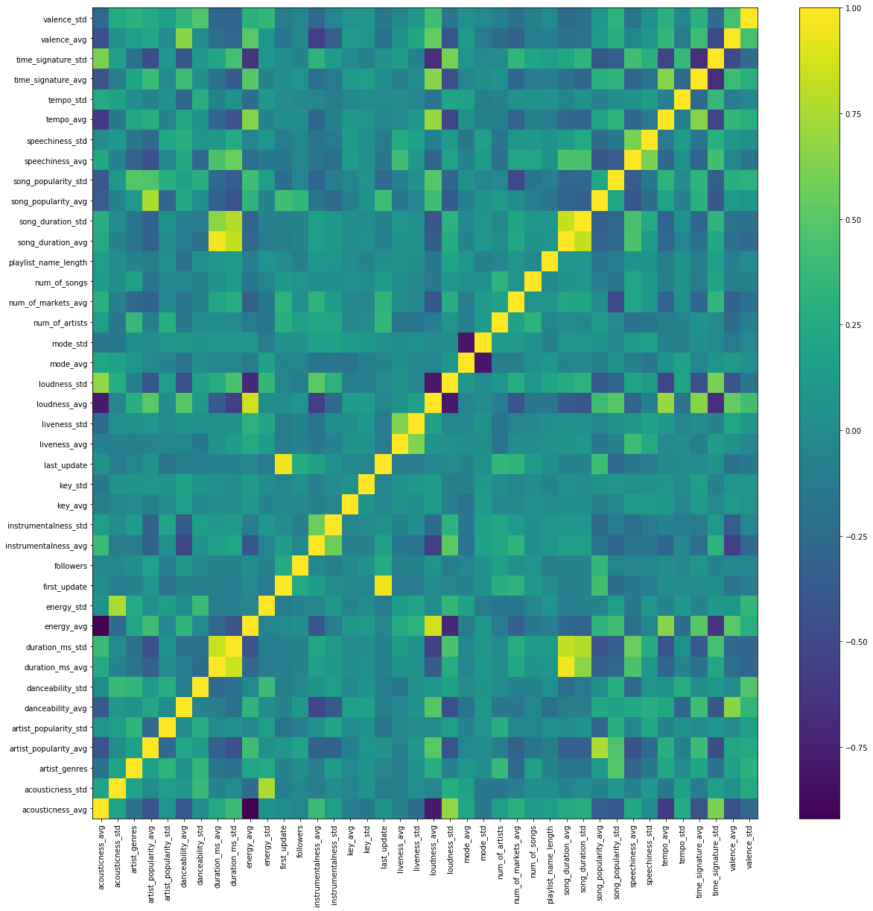
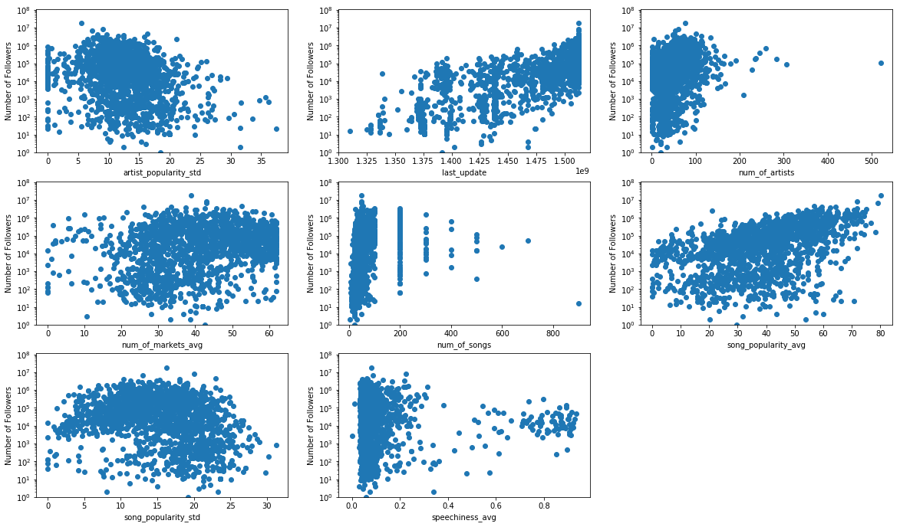

## Contents
{:.no_toc}
*  
{: toc}


```python
import numpy as np
import pandas as pd
import matplotlib.pyplot as plt
from sklearn.preprocessing import MinMaxScaler
import statsmodels.api as sm

%matplotlib inline
```


    /home/pui-user/.local/lib/python2.7/site-packages/statsmodels/compat/pandas.py:56: FutureWarning: The pandas.core.datetools module is deprecated and will be removed in a future version. Please use the pandas.tseries module instead.
      from pandas.core import datetools


### 1. Importing data


```python
data = pd.read_csv('data_spotify_v2.csv', index_col= 0)
print(data.shape)
print(data.columns.values)
data.head(5)
```


    (1669, 42)
    ['acousticness_avg' 'acousticness_std' 'artist_genres'
     'artist_popularity_avg' 'artist_popularity_std' 'danceability_avg'
     'danceability_std' 'duration_ms_avg' 'duration_ms_std' 'energy_avg'
     'energy_std' 'first_update' 'followers' 'instrumentalness_avg'
     'instrumentalness_std' 'is_collaborative' 'is_public' 'key_avg' 'key_std'
     'last_update' 'liveness_avg' 'liveness_std' 'loudness_avg' 'loudness_std'
     'mode_avg' 'mode_std' 'num_of_artists' 'num_of_markets_avg' 'num_of_songs'
     'playlist_name_length' 'song_duration_avg' 'song_duration_std'
     'song_popularity_avg' 'song_popularity_std' 'speechiness_avg'
     'speechiness_std' 'tempo_avg' 'tempo_std' 'time_signature_avg'
     'time_signature_std' 'valence_avg' 'valence_std']


<div>
<style>
    .dataframe thead tr:only-child th {
        text-align: right;
    }

    .dataframe thead th {
        text-align: left;
    }

    .dataframe tbody tr th {
        vertical-align: top;
    }
</style>
<table border="1" class="dataframe">
  <thead>
    <tr style="text-align: right;">
      <th></th>
      <th>acousticness_avg</th>
      <th>acousticness_std</th>
      <th>artist_genres</th>
      <th>artist_popularity_avg</th>
      <th>artist_popularity_std</th>
      <th>danceability_avg</th>
      <th>danceability_std</th>
      <th>duration_ms_avg</th>
      <th>duration_ms_std</th>
      <th>energy_avg</th>
      <th>...</th>
      <th>song_popularity_avg</th>
      <th>song_popularity_std</th>
      <th>speechiness_avg</th>
      <th>speechiness_std</th>
      <th>tempo_avg</th>
      <th>tempo_std</th>
      <th>time_signature_avg</th>
      <th>time_signature_std</th>
      <th>valence_avg</th>
      <th>valence_std</th>
    </tr>
  </thead>
  <tbody>
    <tr>
      <th>0</th>
      <td>0.201550</td>
      <td>0.210138</td>
      <td>35</td>
      <td>89.831579</td>
      <td>5.489996</td>
      <td>0.672320</td>
      <td>0.131615</td>
      <td>207939.980000</td>
      <td>31152.236684</td>
      <td>0.657740</td>
      <td>...</td>
      <td>80.220000</td>
      <td>16.306183</td>
      <td>0.080678</td>
      <td>0.050808</td>
      <td>120.039820</td>
      <td>27.196016</td>
      <td>4.000000</td>
      <td>0.200000</td>
      <td>0.419074</td>
      <td>0.182246</td>
    </tr>
    <tr>
      <th>1</th>
      <td>0.166715</td>
      <td>0.199305</td>
      <td>26</td>
      <td>86.978261</td>
      <td>9.056559</td>
      <td>0.748429</td>
      <td>0.133955</td>
      <td>213376.040816</td>
      <td>40248.254855</td>
      <td>0.627816</td>
      <td>...</td>
      <td>71.960000</td>
      <td>20.083785</td>
      <td>0.225245</td>
      <td>0.134817</td>
      <td>128.362633</td>
      <td>29.037111</td>
      <td>4.020408</td>
      <td>0.246593</td>
      <td>0.450592</td>
      <td>0.208395</td>
    </tr>
    <tr>
      <th>2</th>
      <td>0.115828</td>
      <td>0.128663</td>
      <td>60</td>
      <td>68.231481</td>
      <td>16.317797</td>
      <td>0.608870</td>
      <td>0.146127</td>
      <td>200221.962963</td>
      <td>45993.631187</td>
      <td>0.767889</td>
      <td>...</td>
      <td>56.714286</td>
      <td>22.988906</td>
      <td>0.061541</td>
      <td>0.041325</td>
      <td>125.398907</td>
      <td>25.782681</td>
      <td>3.888889</td>
      <td>0.566558</td>
      <td>0.368354</td>
      <td>0.202621</td>
    </tr>
    <tr>
      <th>3</th>
      <td>0.237346</td>
      <td>0.209753</td>
      <td>25</td>
      <td>79.058824</td>
      <td>12.442671</td>
      <td>0.630980</td>
      <td>0.127485</td>
      <td>227396.918367</td>
      <td>43566.385885</td>
      <td>0.543082</td>
      <td>...</td>
      <td>62.367347</td>
      <td>15.297984</td>
      <td>0.127398</td>
      <td>0.102994</td>
      <td>115.759082</td>
      <td>29.865996</td>
      <td>3.918367</td>
      <td>0.528252</td>
      <td>0.434865</td>
      <td>0.191858</td>
    </tr>
    <tr>
      <th>4</th>
      <td>0.049196</td>
      <td>0.124658</td>
      <td>70</td>
      <td>72.625000</td>
      <td>9.734993</td>
      <td>0.530340</td>
      <td>0.120331</td>
      <td>221541.943396</td>
      <td>28843.710922</td>
      <td>0.787226</td>
      <td>...</td>
      <td>59.415094</td>
      <td>10.342136</td>
      <td>0.063791</td>
      <td>0.049612</td>
      <td>126.416849</td>
      <td>25.883036</td>
      <td>3.905660</td>
      <td>0.445699</td>
      <td>0.508849</td>
      <td>0.204985</td>
    </tr>
  </tbody>
</table>
<p>5 rows × 42 columns</p>
</div>


```python
data.shape
```


    (1669, 42)


```python
data.dropna(how='any', inplace= True)
```


```python
data.info()
```


    <class 'pandas.core.frame.DataFrame'>
    Int64Index: 1669 entries, 0 to 1668
    Data columns (total 42 columns):
    acousticness_avg         1669 non-null float64
    acousticness_std         1669 non-null float64
    artist_genres            1669 non-null int64
    artist_popularity_avg    1669 non-null float64
    artist_popularity_std    1669 non-null float64
    danceability_avg         1669 non-null float64
    danceability_std         1669 non-null float64
    duration_ms_avg          1669 non-null float64
    duration_ms_std          1669 non-null float64
    energy_avg               1669 non-null float64
    energy_std               1669 non-null float64
    first_update             1669 non-null float64
    followers                1669 non-null int64
    instrumentalness_avg     1669 non-null float64
    instrumentalness_std     1669 non-null float64
    is_collaborative         1669 non-null int64
    is_public                1669 non-null int64
    key_avg                  1669 non-null float64
    key_std                  1669 non-null float64
    last_update              1669 non-null float64
    liveness_avg             1669 non-null float64
    liveness_std             1669 non-null float64
    loudness_avg             1669 non-null float64
    loudness_std             1669 non-null float64
    mode_avg                 1669 non-null float64
    mode_std                 1669 non-null float64
    num_of_artists           1669 non-null int64
    num_of_markets_avg       1669 non-null float64
    num_of_songs             1669 non-null int64
    playlist_name_length     1669 non-null int64
    song_duration_avg        1669 non-null float64
    song_duration_std        1669 non-null float64
    song_popularity_avg      1669 non-null float64
    song_popularity_std      1669 non-null float64
    speechiness_avg          1669 non-null float64
    speechiness_std          1669 non-null float64
    tempo_avg                1669 non-null float64
    tempo_std                1669 non-null float64
    time_signature_avg       1669 non-null float64
    time_signature_std       1669 non-null float64
    valence_avg              1669 non-null float64
    valence_std              1669 non-null float64
    dtypes: float64(35), int64(7)
    memory usage: 560.7 KB


### 2. Transforming the data


```python
# Dropping features that present zero variance
data.drop(['is_collaborative', 'is_public'], axis =1 , inplace= True)
```


```python
#scaler = MinMaxScaler().fit(data)

#data1 = scaler.transform(data)

#data1 = pd.DataFrame(data1, columns= data.columns)

data1 = data.copy()
```


```python
data1.head()
```


<div>
<style>
    .dataframe thead tr:only-child th {
        text-align: right;
    }

    .dataframe thead th {
        text-align: left;
    }

    .dataframe tbody tr th {
        vertical-align: top;
    }
</style>
<table border="1" class="dataframe">
  <thead>
    <tr style="text-align: right;">
      <th></th>
      <th>acousticness_avg</th>
      <th>acousticness_std</th>
      <th>artist_genres</th>
      <th>artist_popularity_avg</th>
      <th>artist_popularity_std</th>
      <th>danceability_avg</th>
      <th>danceability_std</th>
      <th>duration_ms_avg</th>
      <th>duration_ms_std</th>
      <th>energy_avg</th>
      <th>...</th>
      <th>song_popularity_avg</th>
      <th>song_popularity_std</th>
      <th>speechiness_avg</th>
      <th>speechiness_std</th>
      <th>tempo_avg</th>
      <th>tempo_std</th>
      <th>time_signature_avg</th>
      <th>time_signature_std</th>
      <th>valence_avg</th>
      <th>valence_std</th>
    </tr>
  </thead>
  <tbody>
    <tr>
      <th>0</th>
      <td>0.201550</td>
      <td>0.210138</td>
      <td>35</td>
      <td>89.831579</td>
      <td>5.489996</td>
      <td>0.672320</td>
      <td>0.131615</td>
      <td>207939.980000</td>
      <td>31152.236684</td>
      <td>0.657740</td>
      <td>...</td>
      <td>80.220000</td>
      <td>16.306183</td>
      <td>0.080678</td>
      <td>0.050808</td>
      <td>120.039820</td>
      <td>27.196016</td>
      <td>4.000000</td>
      <td>0.200000</td>
      <td>0.419074</td>
      <td>0.182246</td>
    </tr>
    <tr>
      <th>1</th>
      <td>0.166715</td>
      <td>0.199305</td>
      <td>26</td>
      <td>86.978261</td>
      <td>9.056559</td>
      <td>0.748429</td>
      <td>0.133955</td>
      <td>213376.040816</td>
      <td>40248.254855</td>
      <td>0.627816</td>
      <td>...</td>
      <td>71.960000</td>
      <td>20.083785</td>
      <td>0.225245</td>
      <td>0.134817</td>
      <td>128.362633</td>
      <td>29.037111</td>
      <td>4.020408</td>
      <td>0.246593</td>
      <td>0.450592</td>
      <td>0.208395</td>
    </tr>
    <tr>
      <th>2</th>
      <td>0.115828</td>
      <td>0.128663</td>
      <td>60</td>
      <td>68.231481</td>
      <td>16.317797</td>
      <td>0.608870</td>
      <td>0.146127</td>
      <td>200221.962963</td>
      <td>45993.631187</td>
      <td>0.767889</td>
      <td>...</td>
      <td>56.714286</td>
      <td>22.988906</td>
      <td>0.061541</td>
      <td>0.041325</td>
      <td>125.398907</td>
      <td>25.782681</td>
      <td>3.888889</td>
      <td>0.566558</td>
      <td>0.368354</td>
      <td>0.202621</td>
    </tr>
    <tr>
      <th>3</th>
      <td>0.237346</td>
      <td>0.209753</td>
      <td>25</td>
      <td>79.058824</td>
      <td>12.442671</td>
      <td>0.630980</td>
      <td>0.127485</td>
      <td>227396.918367</td>
      <td>43566.385885</td>
      <td>0.543082</td>
      <td>...</td>
      <td>62.367347</td>
      <td>15.297984</td>
      <td>0.127398</td>
      <td>0.102994</td>
      <td>115.759082</td>
      <td>29.865996</td>
      <td>3.918367</td>
      <td>0.528252</td>
      <td>0.434865</td>
      <td>0.191858</td>
    </tr>
    <tr>
      <th>4</th>
      <td>0.049196</td>
      <td>0.124658</td>
      <td>70</td>
      <td>72.625000</td>
      <td>9.734993</td>
      <td>0.530340</td>
      <td>0.120331</td>
      <td>221541.943396</td>
      <td>28843.710922</td>
      <td>0.787226</td>
      <td>...</td>
      <td>59.415094</td>
      <td>10.342136</td>
      <td>0.063791</td>
      <td>0.049612</td>
      <td>126.416849</td>
      <td>25.883036</td>
      <td>3.905660</td>
      <td>0.445699</td>
      <td>0.508849</td>
      <td>0.204985</td>
    </tr>
  </tbody>
</table>
<p>5 rows × 40 columns</p>
</div>


### 3. Correlation Matrix


```python
data2 = data1.corr()
plt.figure(figsize= (20,20))
plt.pcolor(data2)
plt.yticks(np.arange(0.5, len(data2.index), 1), data2.index)
plt.xticks(np.arange(0.5, len(data2.columns), 1), data2.columns, rotation = 90)
plt.colorbar()
```


    <matplotlib.colorbar.Colorbar at 0x7f543f094950>





```python
print('correlation of num of followers with other variables: ', data2['followers'])
```


    ('correlation of num of followers with other variables: ', acousticness_avg        -0.045700
    acousticness_std        -0.033745
    artist_genres            0.019638
    artist_popularity_avg    0.188133
    artist_popularity_std   -0.113067
    danceability_avg         0.099056
    danceability_std        -0.041406
    duration_ms_avg         -0.064743
    duration_ms_std         -0.081939
    energy_avg               0.025317
    energy_std              -0.068110
    first_update             0.247618
    followers                1.000000
    instrumentalness_avg    -0.022965
    instrumentalness_std    -0.099799
    key_avg                 -0.019788
    key_std                  0.035601
    last_update              0.252990
    liveness_avg            -0.074864
    liveness_std            -0.063847
    loudness_avg             0.068744
    loudness_std            -0.098970
    mode_avg                -0.046275
    mode_std                 0.042740
    num_of_artists           0.157821
    num_of_markets_avg       0.036694
    num_of_songs             0.072532
    playlist_name_length    -0.101182
    song_duration_avg       -0.061018
    song_duration_std       -0.058117
    song_popularity_avg      0.346298
    song_popularity_std     -0.045608
    speechiness_avg         -0.051610
    speechiness_std         -0.039622
    tempo_avg                0.014758
    tempo_std               -0.032355
    time_signature_avg       0.067693
    time_signature_std      -0.057707
    valence_avg             -0.024068
    valence_std             -0.039637
    Name: followers, dtype: float64)


We can see that the correlation of the number of followers is very low with all other variables


```python
data3 = data1.copy()
```


### 4. Transform the Y variable and check the Correlation 


```python
data3['followers'] = np.log(1 + data3['followers'])
```


```python
print('correlation of log of followers with other variables: \n', data3.corr()['followers'])
```


    ('correlation of log of followers with other variables: \n', acousticness_avg         0.034465
    acousticness_std        -0.147682
    artist_genres           -0.044709
    artist_popularity_avg    0.109756
    artist_popularity_std   -0.274838
    danceability_avg        -0.004691
    danceability_std        -0.123413
    duration_ms_avg         -0.006092
    duration_ms_std         -0.039058
    energy_avg              -0.046161
    energy_std              -0.187641
    first_update             0.669878
    followers                1.000000
    instrumentalness_avg     0.079302
    instrumentalness_std    -0.056911
    key_avg                  0.010541
    key_std                 -0.017376
    last_update              0.711905
    liveness_avg            -0.086897
    liveness_std            -0.132874
    loudness_avg            -0.032210
    loudness_std            -0.047277
    mode_avg                -0.043815
    mode_std                 0.059393
    num_of_artists           0.306043
    num_of_markets_avg       0.224317
    num_of_songs             0.214065
    playlist_name_length    -0.045765
    song_duration_avg       -0.019318
    song_duration_std       -0.056313
    song_popularity_avg      0.407934
    song_popularity_std     -0.262560
    speechiness_avg         -0.020832
    speechiness_std         -0.093477
    tempo_avg               -0.017509
    tempo_std               -0.020939
    time_signature_avg       0.035218
    time_signature_std       0.008535
    valence_avg             -0.110466
    valence_std             -0.138230
    Name: followers, dtype: float64)


### 5. Fit a simple Linear Model


```python
y = (data1['followers'])

X = data1.drop(['followers'], axis = 1)
```


```python
X = sm.add_constant(X)
model = sm.OLS(y,X)
results = model.fit()
results.summary()
```


<table class="simpletable">
<caption>OLS Regression Results</caption>
<tr>
  <th>Dep. Variable:</th>        <td>followers</td>    <th>  R-squared:         </th> <td>   0.175</td> 
</tr>
<tr>
  <th>Model:</th>                   <td>OLS</td>       <th>  Adj. R-squared:    </th> <td>   0.156</td> 
</tr>
<tr>
  <th>Method:</th>             <td>Least Squares</td>  <th>  F-statistic:       </th> <td>   8.876</td> 
</tr>
<tr>
  <th>Date:</th>             <td>Thu, 07 Dec 2017</td> <th>  Prob (F-statistic):</th> <td>2.52e-45</td> 
</tr>
<tr>
  <th>Time:</th>                 <td>16:44:16</td>     <th>  Log-Likelihood:    </th> <td> -24607.</td> 
</tr>
<tr>
  <th>No. Observations:</th>      <td>  1669</td>      <th>  AIC:               </th> <td>4.929e+04</td>
</tr>
<tr>
  <th>Df Residuals:</th>          <td>  1629</td>      <th>  BIC:               </th> <td>4.951e+04</td>
</tr>
<tr>
  <th>Df Model:</th>              <td>    39</td>      <th>                     </th>     <td> </td>    
</tr>
<tr>
  <th>Covariance Type:</th>      <td>nonrobust</td>    <th>                     </th>     <td> </td>    
</tr>
</table>
<table class="simpletable">
<tr>
            <td></td>               <th>coef</th>     <th>std err</th>      <th>t</th>      <th>P>|t|</th>  <th>[0.025</th>    <th>0.975]</th>  
</tr>
<tr>
  <th>const</th>                 <td> -2.05e+06</td> <td> 9.62e+05</td> <td>   -2.130</td> <td> 0.033</td> <td>-3.94e+06</td> <td>-1.62e+05</td>
</tr>
<tr>
  <th>acousticness_avg</th>      <td> 1.352e+05</td> <td> 1.96e+05</td> <td>    0.691</td> <td> 0.490</td> <td>-2.49e+05</td> <td> 5.19e+05</td>
</tr>
<tr>
  <th>acousticness_std</th>      <td> 2.393e+04</td> <td> 3.25e+05</td> <td>    0.074</td> <td> 0.941</td> <td>-6.14e+05</td> <td> 6.62e+05</td>
</tr>
<tr>
  <th>artist_genres</th>         <td> -284.3105</td> <td>  662.189</td> <td>   -0.429</td> <td> 0.668</td> <td>-1583.142</td> <td> 1014.521</td>
</tr>
<tr>
  <th>artist_popularity_avg</th> <td>-1143.7151</td> <td> 2140.779</td> <td>   -0.534</td> <td> 0.593</td> <td>-5342.686</td> <td> 3055.255</td>
</tr>
<tr>
  <th>artist_popularity_std</th> <td>  680.5916</td> <td> 4127.839</td> <td>    0.165</td> <td> 0.869</td> <td>-7415.840</td> <td> 8777.023</td>
</tr>
<tr>
  <th>danceability_avg</th>      <td> 5.665e+05</td> <td> 3.08e+05</td> <td>    1.840</td> <td> 0.066</td> <td>-3.74e+04</td> <td> 1.17e+06</td>
</tr>
<tr>
  <th>danceability_std</th>      <td>  1.13e+05</td> <td> 7.82e+05</td> <td>    0.144</td> <td> 0.885</td> <td>-1.42e+06</td> <td> 1.65e+06</td>
</tr>
<tr>
  <th>duration_ms_avg</th>       <td>   -1.3612</td> <td>    2.812</td> <td>   -0.484</td> <td> 0.628</td> <td>   -6.877</td> <td>    4.155</td>
</tr>
<tr>
  <th>duration_ms_std</th>       <td>    0.7180</td> <td>    0.995</td> <td>    0.722</td> <td> 0.471</td> <td>   -1.234</td> <td>    2.670</td>
</tr>
<tr>
  <th>energy_avg</th>            <td> 1.051e+05</td> <td>  3.7e+05</td> <td>    0.284</td> <td> 0.777</td> <td>-6.21e+05</td> <td> 8.32e+05</td>
</tr>
<tr>
  <th>energy_std</th>            <td> 3.337e+04</td> <td> 6.16e+05</td> <td>    0.054</td> <td> 0.957</td> <td>-1.17e+06</td> <td> 1.24e+06</td>
</tr>
<tr>
  <th>first_update</th>          <td>   -0.0006</td> <td>    0.001</td> <td>   -0.575</td> <td> 0.565</td> <td>   -0.002</td> <td>    0.001</td>
</tr>
<tr>
  <th>instrumentalness_avg</th>  <td> 6.021e+04</td> <td> 1.27e+05</td> <td>    0.475</td> <td> 0.635</td> <td>-1.88e+05</td> <td> 3.09e+05</td>
</tr>
<tr>
  <th>instrumentalness_std</th>  <td>-3.453e+04</td> <td> 1.92e+05</td> <td>   -0.180</td> <td> 0.857</td> <td>-4.11e+05</td> <td> 3.41e+05</td>
</tr>
<tr>
  <th>key_avg</th>               <td> 3268.6127</td> <td> 2.53e+04</td> <td>    0.129</td> <td> 0.897</td> <td>-4.63e+04</td> <td> 5.29e+04</td>
</tr>
<tr>
  <th>key_std</th>               <td> 2.903e+04</td> <td> 5.54e+04</td> <td>    0.524</td> <td> 0.601</td> <td>-7.97e+04</td> <td> 1.38e+05</td>
</tr>
<tr>
  <th>last_update</th>           <td>    0.0015</td> <td>    0.001</td> <td>    1.453</td> <td> 0.146</td> <td>   -0.001</td> <td>    0.004</td>
</tr>
<tr>
  <th>liveness_avg</th>          <td>-3.864e+05</td> <td> 3.83e+05</td> <td>   -1.010</td> <td> 0.313</td> <td>-1.14e+06</td> <td> 3.64e+05</td>
</tr>
<tr>
  <th>liveness_std</th>          <td> 2.523e+05</td> <td> 4.56e+05</td> <td>    0.554</td> <td> 0.580</td> <td>-6.41e+05</td> <td> 1.15e+06</td>
</tr>
<tr>
  <th>loudness_avg</th>          <td> 2865.1148</td> <td> 1.25e+04</td> <td>    0.229</td> <td> 0.819</td> <td>-2.16e+04</td> <td> 2.74e+04</td>
</tr>
<tr>
  <th>loudness_std</th>          <td>-1779.2244</td> <td> 2.62e+04</td> <td>   -0.068</td> <td> 0.946</td> <td>-5.32e+04</td> <td> 4.97e+04</td>
</tr>
<tr>
  <th>mode_avg</th>              <td> 2.063e+05</td> <td> 2.03e+05</td> <td>    1.018</td> <td> 0.309</td> <td>-1.91e+05</td> <td> 6.04e+05</td>
</tr>
<tr>
  <th>mode_std</th>              <td> 2.223e+05</td> <td> 3.69e+05</td> <td>    0.602</td> <td> 0.547</td> <td>-5.02e+05</td> <td> 9.46e+05</td>
</tr>
<tr>
  <th>num_of_artists</th>        <td> 1800.4813</td> <td>  624.631</td> <td>    2.882</td> <td> 0.004</td> <td>  575.318</td> <td> 3025.645</td>
</tr>
<tr>
  <th>num_of_markets_avg</th>    <td>-5495.6106</td> <td> 1597.656</td> <td>   -3.440</td> <td> 0.001</td> <td>-8629.287</td> <td>-2361.934</td>
</tr>
<tr>
  <th>num_of_songs</th>          <td>  306.5917</td> <td>  272.275</td> <td>    1.126</td> <td> 0.260</td> <td> -227.455</td> <td>  840.639</td>
</tr>
<tr>
  <th>playlist_name_length</th>  <td>-3730.1838</td> <td> 2312.914</td> <td>   -1.613</td> <td> 0.107</td> <td>-8266.783</td> <td>  806.415</td>
</tr>
<tr>
  <th>song_duration_avg</th>     <td>    1.1164</td> <td>    2.777</td> <td>    0.402</td> <td> 0.688</td> <td>   -4.331</td> <td>    6.564</td>
</tr>
<tr>
  <th>song_duration_std</th>     <td>   -0.3696</td> <td>    0.940</td> <td>   -0.393</td> <td> 0.694</td> <td>   -2.213</td> <td>    1.474</td>
</tr>
<tr>
  <th>song_popularity_avg</th>   <td> 1.644e+04</td> <td> 2097.925</td> <td>    7.836</td> <td> 0.000</td> <td> 1.23e+04</td> <td> 2.06e+04</td>
</tr>
<tr>
  <th>song_popularity_std</th>   <td>-1.186e+04</td> <td> 4185.899</td> <td>   -2.834</td> <td> 0.005</td> <td>-2.01e+04</td> <td>-3651.605</td>
</tr>
<tr>
  <th>speechiness_avg</th>       <td>  2.62e+05</td> <td> 2.44e+05</td> <td>    1.071</td> <td> 0.284</td> <td>-2.18e+05</td> <td> 7.42e+05</td>
</tr>
<tr>
  <th>speechiness_std</th>       <td>-6.318e+04</td> <td> 3.81e+05</td> <td>   -0.166</td> <td> 0.868</td> <td>-8.11e+05</td> <td> 6.85e+05</td>
</tr>
<tr>
  <th>tempo_avg</th>             <td> 1623.8104</td> <td> 2374.750</td> <td>    0.684</td> <td> 0.494</td> <td>-3034.074</td> <td> 6281.695</td>
</tr>
<tr>
  <th>tempo_std</th>             <td>  356.7017</td> <td> 3184.411</td> <td>    0.112</td> <td> 0.911</td> <td>-5889.270</td> <td> 6602.673</td>
</tr>
<tr>
  <th>time_signature_avg</th>    <td>-1.992e+04</td> <td> 1.31e+05</td> <td>   -0.152</td> <td> 0.879</td> <td>-2.78e+05</td> <td> 2.38e+05</td>
</tr>
<tr>
  <th>time_signature_std</th>    <td>  1.05e+05</td> <td> 1.02e+05</td> <td>    1.029</td> <td> 0.304</td> <td>-9.51e+04</td> <td> 3.05e+05</td>
</tr>
<tr>
  <th>valence_avg</th>           <td>-2.685e+05</td> <td> 1.97e+05</td> <td>   -1.366</td> <td> 0.172</td> <td>-6.54e+05</td> <td> 1.17e+05</td>
</tr>
<tr>
  <th>valence_std</th>           <td>-3.725e+05</td> <td> 4.97e+05</td> <td>   -0.750</td> <td> 0.453</td> <td>-1.35e+06</td> <td> 6.02e+05</td>
</tr>
</table>
<table class="simpletable">
<tr>
  <th>Omnibus:</th>       <td>3357.684</td> <th>  Durbin-Watson:     </th>   <td>   0.625</td>  
</tr>
<tr>
  <th>Prob(Omnibus):</th>  <td> 0.000</td>  <th>  Jarque-Bera (JB):  </th> <td>10717432.555</td>
</tr>
<tr>
  <th>Skew:</th>           <td>15.691</td>  <th>  Prob(JB):          </th>   <td>    0.00</td>  
</tr>
<tr>
  <th>Kurtosis:</th>       <td>394.319</td> <th>  Cond. No.          </th>   <td>1.37e+11</td>  
</tr>
</table>


*** The R-square value is very low. So next we try with the log of the number of followers ***

### 6. Fit a simple Linear Model with the transformed Y variable


```python
y2 = (data3['followers'])

X2 = data3.drop(['followers'], axis = 1)
```


```python
X2.shape, y2.shape
```


    ((1669, 39), (1669,))


```python
X2 = sm.add_constant(X2)
model = sm.OLS(y2,X2)
results = model.fit()
results.summary()
```


<table class="simpletable">
<caption>OLS Regression Results</caption>
<tr>
  <th>Dep. Variable:</th>        <td>followers</td>    <th>  R-squared:         </th> <td>   0.606</td> 
</tr>
<tr>
  <th>Model:</th>                   <td>OLS</td>       <th>  Adj. R-squared:    </th> <td>   0.596</td> 
</tr>
<tr>
  <th>Method:</th>             <td>Least Squares</td>  <th>  F-statistic:       </th> <td>   64.15</td> 
</tr>
<tr>
  <th>Date:</th>             <td>Thu, 07 Dec 2017</td> <th>  Prob (F-statistic):</th> <td>2.19e-296</td>
</tr>
<tr>
  <th>Time:</th>                 <td>16:44:18</td>     <th>  Log-Likelihood:    </th> <td> -3596.3</td> 
</tr>
<tr>
  <th>No. Observations:</th>      <td>  1669</td>      <th>  AIC:               </th> <td>   7273.</td> 
</tr>
<tr>
  <th>Df Residuals:</th>          <td>  1629</td>      <th>  BIC:               </th> <td>   7489.</td> 
</tr>
<tr>
  <th>Df Model:</th>              <td>    39</td>      <th>                     </th>     <td> </td>    
</tr>
<tr>
  <th>Covariance Type:</th>      <td>nonrobust</td>    <th>                     </th>     <td> </td>    
</tr>
</table>
<table class="simpletable">
<tr>
            <td></td>               <th>coef</th>     <th>std err</th>      <th>t</th>      <th>P>|t|</th>  <th>[0.025</th>    <th>0.975]</th>  
</tr>
<tr>
  <th>const</th>                 <td>  -50.1709</td> <td>    3.281</td> <td>  -15.292</td> <td> 0.000</td> <td>  -56.606</td> <td>  -43.736</td>
</tr>
<tr>
  <th>acousticness_avg</th>      <td>   -0.5296</td> <td>    0.667</td> <td>   -0.794</td> <td> 0.427</td> <td>   -1.838</td> <td>    0.779</td>
</tr>
<tr>
  <th>acousticness_std</th>      <td>    0.5158</td> <td>    1.110</td> <td>    0.465</td> <td> 0.642</td> <td>   -1.661</td> <td>    2.693</td>
</tr>
<tr>
  <th>artist_genres</th>         <td>   -0.0007</td> <td>    0.002</td> <td>   -0.328</td> <td> 0.743</td> <td>   -0.005</td> <td>    0.004</td>
</tr>
<tr>
  <th>artist_popularity_avg</th> <td>   -0.0003</td> <td>    0.007</td> <td>   -0.047</td> <td> 0.962</td> <td>   -0.015</td> <td>    0.014</td>
</tr>
<tr>
  <th>artist_popularity_std</th> <td>   -0.0506</td> <td>    0.014</td> <td>   -3.598</td> <td> 0.000</td> <td>   -0.078</td> <td>   -0.023</td>
</tr>
<tr>
  <th>danceability_avg</th>      <td>   -0.5647</td> <td>    1.050</td> <td>   -0.538</td> <td> 0.591</td> <td>   -2.624</td> <td>    1.494</td>
</tr>
<tr>
  <th>danceability_std</th>      <td>    6.6558</td> <td>    2.668</td> <td>    2.495</td> <td> 0.013</td> <td>    1.423</td> <td>   11.889</td>
</tr>
<tr>
  <th>duration_ms_avg</th>       <td>  -1.7e-05</td> <td> 9.59e-06</td> <td>   -1.773</td> <td> 0.076</td> <td>-3.58e-05</td> <td> 1.81e-06</td>
</tr>
<tr>
  <th>duration_ms_std</th>       <td>  5.95e-06</td> <td> 3.39e-06</td> <td>    1.754</td> <td> 0.080</td> <td>-7.05e-07</td> <td> 1.26e-05</td>
</tr>
<tr>
  <th>energy_avg</th>            <td>   -1.1135</td> <td>    1.263</td> <td>   -0.882</td> <td> 0.378</td> <td>   -3.590</td> <td>    1.364</td>
</tr>
<tr>
  <th>energy_std</th>            <td>   -5.5955</td> <td>    2.099</td> <td>   -2.666</td> <td> 0.008</td> <td>   -9.712</td> <td>   -1.479</td>
</tr>
<tr>
  <th>first_update</th>          <td>-5.887e-09</td> <td> 3.36e-09</td> <td>   -1.753</td> <td> 0.080</td> <td>-1.25e-08</td> <td>    7e-10</td>
</tr>
<tr>
  <th>instrumentalness_avg</th>  <td>   -0.1043</td> <td>    0.432</td> <td>   -0.241</td> <td> 0.809</td> <td>   -0.952</td> <td>    0.743</td>
</tr>
<tr>
  <th>instrumentalness_std</th>  <td>    0.8034</td> <td>    0.654</td> <td>    1.229</td> <td> 0.219</td> <td>   -0.479</td> <td>    2.085</td>
</tr>
<tr>
  <th>key_avg</th>               <td>    0.1720</td> <td>    0.086</td> <td>    1.996</td> <td> 0.046</td> <td>    0.003</td> <td>    0.341</td>
</tr>
<tr>
  <th>key_std</th>               <td>   -0.0531</td> <td>    0.189</td> <td>   -0.281</td> <td> 0.779</td> <td>   -0.424</td> <td>    0.318</td>
</tr>
<tr>
  <th>last_update</th>           <td> 4.295e-08</td> <td> 3.53e-09</td> <td>   12.153</td> <td> 0.000</td> <td>  3.6e-08</td> <td> 4.99e-08</td>
</tr>
<tr>
  <th>liveness_avg</th>          <td>    1.3219</td> <td>    1.305</td> <td>    1.013</td> <td> 0.311</td> <td>   -1.237</td> <td>    3.881</td>
</tr>
<tr>
  <th>liveness_std</th>          <td>   -3.0261</td> <td>    1.554</td> <td>   -1.948</td> <td> 0.052</td> <td>   -6.074</td> <td>    0.021</td>
</tr>
<tr>
  <th>loudness_avg</th>          <td>    0.0140</td> <td>    0.043</td> <td>    0.329</td> <td> 0.742</td> <td>   -0.069</td> <td>    0.098</td>
</tr>
<tr>
  <th>loudness_std</th>          <td>    0.1495</td> <td>    0.089</td> <td>    1.672</td> <td> 0.095</td> <td>   -0.026</td> <td>    0.325</td>
</tr>
<tr>
  <th>mode_avg</th>              <td>    1.5777</td> <td>    0.691</td> <td>    2.282</td> <td> 0.023</td> <td>    0.222</td> <td>    2.934</td>
</tr>
<tr>
  <th>mode_std</th>              <td>    2.3314</td> <td>    1.259</td> <td>    1.852</td> <td> 0.064</td> <td>   -0.138</td> <td>    4.800</td>
</tr>
<tr>
  <th>num_of_artists</th>        <td>    0.0082</td> <td>    0.002</td> <td>    3.830</td> <td> 0.000</td> <td>    0.004</td> <td>    0.012</td>
</tr>
<tr>
  <th>num_of_markets_avg</th>    <td>   -0.0193</td> <td>    0.005</td> <td>   -3.551</td> <td> 0.000</td> <td>   -0.030</td> <td>   -0.009</td>
</tr>
<tr>
  <th>num_of_songs</th>          <td>    0.0049</td> <td>    0.001</td> <td>    5.312</td> <td> 0.000</td> <td>    0.003</td> <td>    0.007</td>
</tr>
<tr>
  <th>playlist_name_length</th>  <td>   -0.0093</td> <td>    0.008</td> <td>   -1.180</td> <td> 0.238</td> <td>   -0.025</td> <td>    0.006</td>
</tr>
<tr>
  <th>song_duration_avg</th>     <td>  1.88e-05</td> <td> 9.47e-06</td> <td>    1.985</td> <td> 0.047</td> <td> 2.24e-07</td> <td> 3.74e-05</td>
</tr>
<tr>
  <th>song_duration_std</th>     <td>-7.191e-06</td> <td>  3.2e-06</td> <td>   -2.244</td> <td> 0.025</td> <td>-1.35e-05</td> <td>-9.06e-07</td>
</tr>
<tr>
  <th>song_popularity_avg</th>   <td>    0.0550</td> <td>    0.007</td> <td>    7.694</td> <td> 0.000</td> <td>    0.041</td> <td>    0.069</td>
</tr>
<tr>
  <th>song_popularity_std</th>   <td>   -0.0676</td> <td>    0.014</td> <td>   -4.736</td> <td> 0.000</td> <td>   -0.096</td> <td>   -0.040</td>
</tr>
<tr>
  <th>speechiness_avg</th>       <td>    2.7265</td> <td>    0.834</td> <td>    3.271</td> <td> 0.001</td> <td>    1.091</td> <td>    4.362</td>
</tr>
<tr>
  <th>speechiness_std</th>       <td>   -0.8743</td> <td>    1.300</td> <td>   -0.673</td> <td> 0.501</td> <td>   -3.424</td> <td>    1.675</td>
</tr>
<tr>
  <th>tempo_avg</th>             <td>    0.0055</td> <td>    0.008</td> <td>    0.678</td> <td> 0.498</td> <td>   -0.010</td> <td>    0.021</td>
</tr>
<tr>
  <th>tempo_std</th>             <td>    0.0002</td> <td>    0.011</td> <td>    0.023</td> <td> 0.982</td> <td>   -0.021</td> <td>    0.022</td>
</tr>
<tr>
  <th>time_signature_avg</th>    <td>    0.3896</td> <td>    0.448</td> <td>    0.870</td> <td> 0.384</td> <td>   -0.489</td> <td>    1.268</td>
</tr>
<tr>
  <th>time_signature_std</th>    <td>    0.1219</td> <td>    0.348</td> <td>    0.350</td> <td> 0.726</td> <td>   -0.560</td> <td>    0.804</td>
</tr>
<tr>
  <th>valence_avg</th>           <td>    1.5720</td> <td>    0.670</td> <td>    2.346</td> <td> 0.019</td> <td>    0.258</td> <td>    2.886</td>
</tr>
<tr>
  <th>valence_std</th>           <td>   -1.6397</td> <td>    1.693</td> <td>   -0.968</td> <td> 0.333</td> <td>   -4.961</td> <td>    1.682</td>
</tr>
</table>
<table class="simpletable">
<tr>
  <th>Omnibus:</th>       <td>525.043</td> <th>  Durbin-Watson:     </th> <td>   1.450</td>
</tr>
<tr>
  <th>Prob(Omnibus):</th> <td> 0.000</td>  <th>  Jarque-Bera (JB):  </th> <td>2564.617</td>
</tr>
<tr>
  <th>Skew:</th>          <td>-1.406</td>  <th>  Prob(JB):          </th> <td>    0.00</td>
</tr>
<tr>
  <th>Kurtosis:</th>      <td> 8.383</td>  <th>  Cond. No.          </th> <td>1.37e+11</td>
</tr>
</table>


### 7. Identify the relevant variables


```python
relevant = results.pvalues[results.pvalues < 0.005]

relevant
```


    const                    1.979354e-49
    artist_popularity_std    3.307456e-04
    last_update              1.356523e-32
    num_of_artists           1.329988e-04
    num_of_markets_avg       3.950970e-04
    num_of_songs             1.232451e-07
    song_popularity_avg      2.448120e-14
    song_popularity_std      2.369755e-06
    speechiness_avg          1.095569e-03
    dtype: float64


```python
len(relevant)
```


    9


# The variables seen here with P< 0.5 are the relevant variables. Even though the R square value is still in the range of 0.21 it is much better than the case where a log value of the number of followers was not considered

### 8. Visualization


```python
plt.figure(figsize=(20,20))

i=1

for r in relevant.index[1:]:
    
    plt.subplot(5,3,i)
    plt.scatter(data1[r], data1['followers'])
    plt.yscale('log')
    plt.xlabel(r)
    plt.ylabel('Number of Followers')
    plt.ylim(ymin=1)
        
    i += 1
    
    
    
    
```




